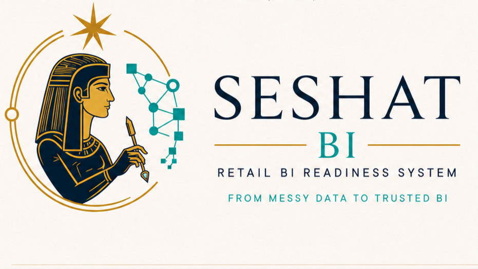
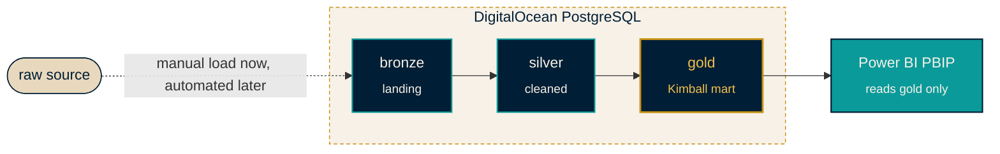

<div align="center">



<br/>

An agent-first Retail BI readiness system: profile the source, map its meaning,
build the medallion warehouse, validate it, define metrics, prepare the semantic
model, design the dashboard -- and only then publish.

<br/>

[](#what-is-built-today)
[](#architecture)
[](#power-bi-policy)
[](docs/glossary.md)
[](#install)
[](LICENSE)

<br/>

**From messy retail data to trusted, governed BI -- with an agent that refuses to skip a step.**

</div>

---

## Why Seshat

Ungoverned BI ships wrong numbers with total confidence. Seshat BI takes the
opposite stance, named for the ancient Egyptian figure of writing and
measurement: **nothing advances without recorded evidence and a passed gate.**
Readiness is never a faked confidence score -- it is `status` + `evidence` +
`blocking_reasons`, at every one of seven stages.

> [!NOTE]
> **Naming.** The product is **Seshat BI**. The distribution is `seshat-bi` and the
> import module is `seshat`; `seshat` is also the primary command, with `retail`
> kept as a deprecated compatibility command/module for one deprecation cycle.
> It was previously developed under the internal name *Tower BI Agent Kit*; the
> governance spine is still called the **Readiness System**. Same product, one brand.

---

## Who it's for

- **BI developers & data engineers** -- a governed medallion (`bronze -> silver -> gold`) and Power BI delivery that refuses to skip mapping, validation, or metric contracts.
- **AI-agent builders** -- an agent-first tool (Claude Code & Codex plugins) that stays truthful on real data: it withholds PII, won't invent a mapping, and won't fake a pass.
- **Analytics leads** -- trust and auditability by construction. Every dashboard traces to a metric contract; every stage carries its evidence.

---

## See it in 15 seconds

No database, no Power BI Desktop. Run the bundled synthetic retail fixture offline:

```bash
seshat demo init
seshat demo run
seshat demo report --format html
```


The report shows evidence, blockers, approvals, and the next allowed action for all
seven stages. Offline proof stops honestly at Gold Ready -- live validation needs a
database.

---

## Install

`seshat-bi` `v0.2.0` is on public PyPI (clean-install verified -- see the
[public acceptance record](docs/releases/v0.2.0-public-acceptance.md)).

**Python CLI**

```bash
pipx install seshat-bi
seshat init-project my-bi
```

**Claude Code plugin** (validated on Claude Code 2.1.209, Windows)

```text
/plugin marketplace add ahmed-shaaban-94/Seshat_BI
/plugin install seshat-bi@seshat-bi-marketplace
```

**Codex plugin** (install/discovery validated)

```text
codex plugin marketplace add https://github.com/ahmed-shaaban-94/Seshat_BI
codex plugin add seshat-bi@seshat-bi-repository
```

Full guides: [user install](docs/install/user-install.md) - [agent install](docs/install/agent-install.md) - [support matrix](docs/install/support-matrix.md). The Python CLI (`seshat` / `retail`) and the agent plugins are separate: the CLI runs governance checks; a plugin gives an agent session the skills and commands.

---

## The seven-star readiness spine

Seven stages, each a gate: a stage is never entered before the prior one passes. This ordering is the product.

```mermaid
flowchart LR
    RAW([raw source]):::raw
    S1[1 - Source Ready<br/><sub>profiled and understood</sub>]:::stage
    S2[2 - Mapping Ready<br/><sub>grain / keys / PII / placement</sub>]:::stage
    S3[3 - Silver Ready<br/><sub>typed, cleaned, statically clean</sub>]:::stage
    S4[4 - Gold Ready<br/><sub>Kimball mart + live-validated</sub>]:::stage
    S5[5 - Semantic Model Ready<br/><sub>metric contracts + governed model</sub>]:::stage
    S6[6 - Dashboard Ready<br/><sub>designed from approved metrics</sub>]:::stage
    S7[7 - Publish Ready<br/><sub>handoff pack, approved to publish</sub>]:::stage

    RAW --> S1 --> S2 --> S3 --> S4 --> S5 --> S6 --> S7

    classDef raw fill:#E8D8BD,stroke:#001E35,stroke-width:1px,color:#001E35;
    classDef stage fill:#001E35,stroke:#C69214,stroke-width:1.5px,color:#F7F1E7;
```



The ordering is non-negotiable, and the gates are the product:

> [!IMPORTANT]
> - No source goes directly to silver.
> - No gold reaches Power BI before validation.
> - No dashboard is designed before its metrics are defined.
> - No Power BI execution runs before semantic-model readiness.

---

## Why Seshat is different

- **Evidence over scores.** Readiness is `status` + `evidence` + `blocking_reasons`, never a fabricated number.
- **The gates are the product.** No source goes straight to silver; no gold reaches Power BI unvalidated; no dashboard is designed before its metrics are defined.
- **Agent-safe by construction.** The `seshat mcp` governor and the plugins refuse execution and approval; they withhold PII and won't invent mappings.
- **Power BI reads `gold` only.** Reporting is the target, never the source of truth.
- **Honest offline proof.** The demo renders real evidence and stops truthfully at the live boundary.

---

## What is built today

Everything below is on `main`, spec-backed, and held by the `retail check` gate. Highlights:

- The static `retail check` gate over SQL, TMDL/PBIR, DAX, config, and docs.
- Live `retail validate` (PK uniqueness, date coverage, orphan FKs, reconciliation).
- The full seven-stage readiness spine (source intelligence -> handoff pack).
- Agent surfaces: `seshat status` / `next`, offline HTML proof, read-only MCP governor, review/SARIF output.
- The `seshat` CLI + `init-project`, PBIR authoring adapters, and companion dbt / Dagster adapters.

<details>
<summary>Full capability list</summary>

| Capability | What it gives you |
|------------|-------------------|
| **Spec-Kit foundation + agent constitution** | The governance law every workflow obeys (`.specify/memory/constitution.md`). |
| **Source-mapping gate** | `source-map.yaml` must be reviewed before any silver SQL is written. |
| **`retail check` (static gate)** | A static gate over committed SQL, TMDL/PBIR, config, docs, and repo text (rule catalog: `docs/glossary.md`); the exit code is the authority. |
| **`retail validate` (live surface)** | PK uniqueness, date coverage, orphan FKs, reconciliation, source-map-driven checks. |
| **DAX governance L1-L2** | DAX best-practice rules `D1`-`D11` enforced statically inside `retail check` (single-quote handling, `ALL`-variants, dollar-quote tokenizer, and more). |
| **`retail semantic-check` (L3 contract drift)** | Detects when a committed measure's denominator drifts from its metric contract. |
| **`retail value-check` (L4 value proxy)** | Recomputes a measure's live aggregate and compares it to an owner-approved expected value within tolerance -- never fakes a pass. |
| **`retail generate` (DAX Generator)** | Generates a verified best-practice DAX measure from an approved metric contract, with a self-proving loop. |
| **`retail status` (agent-control surface)** | A read-only `--format json` projection of committed readiness state (per-table `current_stage`, `evidence`, `blocking_reasons`, `next_action`) for an agent/host to poll -- a projection of committed evidence, never a computed or fabricated score. |
| **`seshat` command + `init-project`** | `seshat` is the product-brand alias of `retail` (same entry point). `seshat init-project <name>` scaffolds a fresh, empty Retail-BI project workspace for a new user. |
| **PBIR authoring adapters** | Deterministic, local-file, reviewable writers for committed PBIR JSON: `pbir-apply-theme`, `pbir-format-visual`, `pbir-set-page-background`, `pbir-set-geometry` -- style/lay out existing bound visuals; never create/retype a visual or grant a stage. Publish/execution stays gated (F016). |
| **Readiness spine (F005-F015, incl. F011A)** | The full seven-stage model: source intelligence, grain confidence, metric contracts, semantic-model readiness, dashboard design + the four-surface Visual Foundation, QC control room, reconciliation ledger, drift detector. |
| **Companion Modules & Adapters (F025-F030)** | Six docs-first skills: PR readiness reviewer, readiness viewer, approval console, evidence-pack generator, and optional **dbt** / **Dagster** adapters (advisory only -- they never create truth). |
| **F034 authoring slice** | The trace template, Dashboard Ready evidence item, and the read-only visual-implementation-review workflow (the built page itself stays a human Power BI Desktop action). |
| **C086 pharmacy worked example** | A complete, filled run of the pipeline -- proof of the pattern, not the universal schema. |
| **retail_store_sales worked example** | The validated worked example -- traverses the full seven-stage spine (to Dashboard Ready, Publish Ready `warning`) -- proves the generic playbook (no returns; PII kept; English-only). |
| **Offline readiness proof (HTML)** | `seshat demo report --format html` renders the seven-stage proof as a static, disclosure-safe page -- evidence, blockers, approvals, next action; honest stop at the live boundary (spec 120 US1). |
| **Review integration (`--format review`/`sarif` + GitHub action)** | Stable review JSON with changed-state digest, optional SARIF 2.1.0, and a read-only composite action under `integrations/github-action/` (spec 120 US2). |
| **`seshat mcp` (read-only agent governor)** | Optional stable MCP v1 stdio adapter exposing six read-only governance tools; refuses execution and approval by construction ([docs](docs/ecosystem/agent-governor.md), spec 120 US3). |
| **`seshat passport export/verify`** | Portable, disclosure-safe readiness evidence snapshots with content-hash verification (verified/changed/missing/incompatible/unavailable) -- records approvals, never grants them ([docs](docs/ecosystem/readiness-passport.md), spec 120 US4). |
| **`seshat pack scaffold/validate`** | Governed, declarative local extension packs across six knowledge categories, with fail-closed validation and three generic reference packs ([docs](docs/ecosystem/extension-packs.md), spec 120 US5). |
| **Contributor surfaces** | Five structured issue forms, an evidence-prompting PR template, and five bounded starter lanes reachable through three documents ([start here](docs/contributing/first-contribution.md), spec 120 US6). |
| **`seshat benchmark run/report`** | Vendor-neutral categorical agent safety benchmark with a deterministic scripted reference participant and disclosed run conditions -- never a score or leaderboard ([docs](docs/ecosystem/agent-safety-benchmark.md), spec 120 US7). |
| **`seshat explorer build`** | Self-contained offline HTML portfolio explorer: table-by-stage status, evidence availability, blockers, approvals, metric lineage; disclosure-gated generation ([docs](docs/ecosystem/readiness-explorer.md), spec 120 US8). |

A green static check is necessary but not sufficient: semantic correctness needs
the live validation boundary when a database is available.

</details>

---

## Architecture



Responsibilities stay separated; Power BI is the reporting target, never the
source of truth.

| Layer | Responsibility |
|-------|----------------|
| **Agent Experience** | Reads readiness state, performs only the next allowed action. |
| **Source Intelligence** | Profiles sources, detects grain, maps business meaning, tracks drift. |
| **Mapping Governance** | Makes `source-map.yaml` reviewable before any silver SQL. |
| **Validation & Readiness** | `retail check`, `retail validate`, QC control room, reconciliation ledger. |
| **Metrics & Semantic Model** | KPI packs, metric contracts, semantic-model readiness. |
| **Dashboard & Delivery** | Dashboard blueprints and handoff packs; execution adapter comes last. |

---

## Start here as an agent

**Agent Mode** -- the guarded loop (inspect -> `seshat status` -> `seshat next`
-> do only the next allowed action -> `seshat check` -> stop at the gate) is
documented in [`docs/agent-mode.md`](docs/agent-mode.md). `seshat next
--format agent` (or `--format json` for hosts) answers: current stage,
readiness state, evidence, blockers, next allowed action, forbidden scope,
validation commands, and the stop point.

Read in this order, then act on the target's readiness state -- and only the next
allowed action:

1. `AGENTS.md` -- the short operating contract: what the agent can and cannot do.
2. `.specify/memory/constitution.md` -- the full governance law.
3. `docs/readiness/readiness-model.md` -- the seven-stage spine.
4. `docs/architecture/readiness-pipeline.md` -- how readiness sits on the kit.
5. `docs/worked-examples/retail-store-sales.md` -- the filled worked example; the full spine to Dashboard Ready.
6. `docs/worked-examples/README.md` -- the worked-examples index (which to read when).

<details>
<summary><b>Typical agent flow</b></summary>

```text
read readiness status
  -> profile source
  -> draft source-map.yaml
  -> record assumptions / questions / issues
  -> STOP for review if mapping is blocked
  -> build silver only after Mapping Ready passes
  -> build gold only after silver is clean
  -> validate gold before Power BI
  -> define metric contracts before dashboard design
  -> create handoff pack before publish
```

</details>

---

## Repository layout

<details>
<summary>Where everything lives</summary>

| Path | Purpose |
|------|---------|
| `AGENTS.md` | Operating contract for AI agents. Read first. |
| `.specify/` | Spec-Kit constitution and governance memory. |
| `src/seshat/` | The `retail` CLI package: static + live governance surfaces. |
| `warehouse/` | Tool-agnostic medallion SQL: `bronze` / `silver` / `gold` + migrations. |
| `powerbi/` | Power BI PBIP artifacts. Power BI reads `gold` only. |
| `specs/` | Feature specs, plans, tasks, checklists (one directory per feature; see `specs/README.md`). |
| `mappings/` | Filled per-table source-mapping artifacts, one folder per table. |
| `templates/` | Generic blanks: profiles, maps, contracts, readiness, dashboards, handoff packs. |
| `reports/` | Dashboard / page / visual blueprints and delivery artifacts. |
| `pipelines/` | Ingestion area: manual now, automated feed later. |
| `docs/readiness/` | The seven-stage Readiness System spine. |
| `docs/roadmap/` | Delivered ledger + the planned companion tier. |
| `docs/brand/` | The **Seshat BI** visual identity and brand rules. |
| `assets/brand/` | Committed brand assets (logo, Seshat star). |

</details>

---

## Power BI policy

Power BI is the reporting target, not the source of truth.

- Reads from `gold` only.
- Every measure traces to a metric contract; blueprints invent no KPIs.
- PBIP artifacts stay source-control friendly (plain-text TMDL/PBIR).
- Existing PBIP projects start with the read-only [`seshat adopt-pbip assess`](docs/tools/pbip-adoption.md) path; it creates no readiness pass or approval.
- Publishing / execution automation is deferred until semantic-model readiness passes.

---

## Roadmap

The originally-specified sequence (**F005-F015, including F011A**) is fully
shipped to `main`. What remains is deliberately **human-gated** or **deferred for
want of a consumer** -- never blocked by missing effort:

> [!WARNING]
> The items below are **not current capabilities.** Do not treat a gated or
> deferred feature as if it were shipped.

| Remaining item | State | Why it waits |
|----------------|-------|--------------|
| **F016 -- Power BI execution adapter** | gated, by design | Execution-only (materializes/publishes an already-approved model; cannot define metrics, mappings, semantic logic, or dashboard design). Deliberately last; not startable before `semantic_model_ready` is `pass`. |
| **F034 built page** | human action | The agent ships the trace template + review workflow; a person builds the approved design in Power BI Desktop and commits the PBIR. |
| **F024 + F031-F033** | spec-only | Companion architecture doc + maintenance automation -- no runtime consumer yet (the adapters they would maintain are docs-only skills). |
| **pbi-tools extract / L3 new operators** | deferred | Revisit when a real `.pbix` + installed toolchain (pbi-tools) or a real predicate consumer (L3) appears. |

> [!NOTE]
> The **Companion Modules & Adapters** that *did* ship (F025-F030 -- PR readiness
> reviewer, readiness viewer, approval console, evidence-pack generator, and the
> optional **dbt** / **Dagster** adapters) are listed under
> [What is built today](#what-is-built-today). dbt and Dagster are *optional
> companion engines* and advisory only -- they never create truth.

Guiding rules: any new feature must improve exactly one readiness stage, and
docs / templates / checklists come before automation. Full ledger:
[`docs/roadmap/roadmap.md`](docs/roadmap/roadmap.md).

---

## What this is not

Seshat BI is a small, governed Retail BI factory -- agent-led, evidence-based, and
blocked by real BI gates before delivery. It is deliberately **not**:

- a one-click automatic dashboard generator,
- a Fabric deployment platform,
- an ML / forecasting system,
- a universal ERP connector,
- a fully automated mapping-approval engine,
- a Power BI execution-first tool.

---

## Brand

The public identity is **Seshat BI**: the seated Seshat figure with a stylus
(mapping and documentation before transformation), a gold star (canonical truth and
the seven readiness gates), and a teal data network (lineage and the BI model).

<div align="center">

</div>

Full guide: [`docs/brand/visual-identity.md`](docs/brand/visual-identity.md) --
reusable mark: [`assets/brand/seshat-seven-star.svg`](assets/brand/seshat-seven-star.svg).

Palette: `deep_navy #001E35` | `rich_gold #C69214` | `teal #0B9A9A` | `ivory #F7F1E7`.

---

## Contributing

- Commit subjects follow `<type>: <description>` (`feat` / `fix` / `refactor` /
  `docs` / `chore` / `build` / `ci` / `perf` / `test` / `style` / `revert` / `brand`),
  **scope-free** -- no `docs(018):` parentheses (governance rule P2). An automated
  `[bot] ...` subject prefix is exempt.
- Conventions: [`docs/conventions.md`](docs/conventions.md).
- Glossary (terms, abbreviations, rule ids): [`docs/glossary.md`](docs/glossary.md).
- Contributing (setup, local checks, PR flow): [`CONTRIBUTING.md`](CONTRIBUTING.md).
- First contribution (three-document newcomer path + bounded starter lanes): [`docs/contributing/first-contribution.md`](docs/contributing/first-contribution.md).
- FAQ (common questions, with sources): [`docs/faq.md`](docs/faq.md).
- Release notes: [`RELEASE_NOTES.md`](RELEASE_NOTES.md) -- and the v0.1 snapshot [`docs/releases/v0.1.md`](docs/releases/v0.1.md).
- Local verification (mirrors CI intent): [`docs/quality/local-verification.md`](docs/quality/local-verification.md).
- Guided demo (worked example): [`docs/demo/retail-store-sales-demo.md`](docs/demo/retail-store-sales-demo.md).
- Capability snapshot: [`docs/quality/post-idea-bank-capability-state.md`](docs/quality/post-idea-bank-capability-state.md) -- what works now / planned / forbidden / needs-ruling / needs-data, by layer.
- Net Sales end-to-end trace (paper proof of one KPI path): [`docs/demo/net-sales-end-to-end-readiness-trace.md`](docs/demo/net-sales-end-to-end-readiness-trace.md).
- Big Data strategy (scale is a condition, not a tool): [`docs/big-data/big-data-capability-report.md`](docs/big-data/big-data-capability-report.md) + the assessment templates [`docs/big-data/data-volume-assessment.md`](docs/big-data/data-volume-assessment.md).
- Integration smoke test for the idea-bank features: [`docs/quality/top-idea-bank-integration-smoke-test.md`](docs/quality/top-idea-bank-integration-smoke-test.md).
- Before a PR, `retail check` must pass and committed text must be ASCII / UTF-8
  without BOM.
- License: Apache-2.0 (see [LICENSE](LICENSE)).

<div align="center">
<br/>
<sub>Seshat BI -- governed knowledge, measured structure, trusted BI.</sub>
</div>
