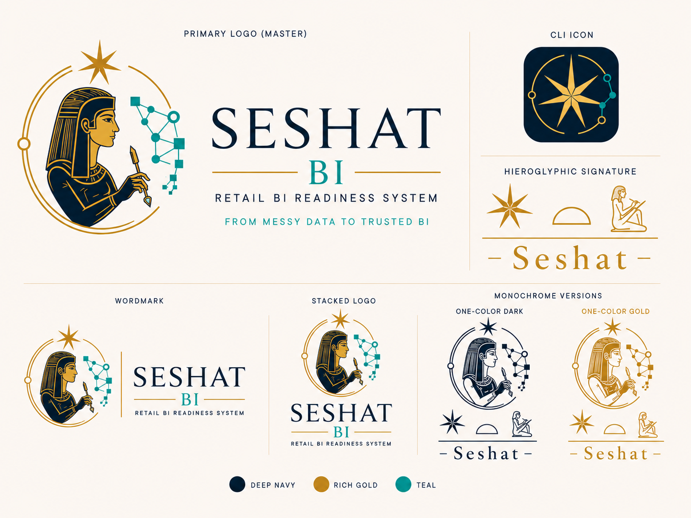

<div align="center">


# Seshat BI

**From messy retail data to trusted, governed BI.**

An agent-first Retail BI readiness system: profile the source, map its meaning,
build the medallion warehouse, validate it, define metrics, prepare the semantic
model, design the dashboard -- and only then publish.

<br/>


</div>

---

## Why Seshat

Seshat was the ancient Egyptian figure of writing, measurement, and record
keeping -- you mapped and documented the world before you built on it. This tool
takes the same stance toward retail data: **nothing advances without recorded
evidence and a passed gate.**

Seshat BI answers one question, safely:

> Is this retail source ready to become trusted Power BI analytics?

It is not a pile of SQL scripts and `.pbix` files. It is a disciplined operating
kit for an AI agent (or a BI developer) that refuses to skip a step. Readiness is
never a faked confidence score -- it is `status` + `evidence` + `blocking_reasons`.

> [!NOTE]
> **Naming.** The product is **Seshat BI** (CLI / package alias `Seshat_BI`).
> It was previously developed under the internal name *Tower BI Agent Kit*; the
> governance spine is still called the **Readiness System**. Same product, one brand.

---

## The seven-star readiness spine

The seven points of the Seshat star are the seven readiness stages. Each is a
gate: a stage is never entered before the prior one passes.

```text
  raw source
    1  Source Ready          profiled and understood
    2  Mapping Ready         grain, keys, PII, placement mapped + reviewed
    3  Silver Ready          typed/cleaned tables, statically clean
    4  Gold Ready            Kimball mart built + live-validated
    5  Semantic Model Ready  metric contracts + governed Power BI model
    6  Dashboard Ready       report designed from approved metrics only
    7  Publish Ready         handoff pack complete, approved to publish
```

The ordering is non-negotiable, and the gates are the product:

```text
No source goes directly to silver.
No gold reaches Power BI before validation.
No dashboard is designed before its metrics are defined.
No Power BI execution runs before semantic-model readiness.
```

---

## Quickstart

Seshat BI ships a Python package, `retail`, with two governance surfaces.

```bash
# clone
git clone https://github.com/ahmed-shaaban-94/Seshat_BI.git
cd Seshat_BI

# install (editable, with dev extras)
python -m venv .venv
. .venv/Scripts/activate          # Windows Git Bash / PowerShell: use the matching activate
pip install -e ".[dev]"

# run the static governance gate over the whole repo
retail check                       # exit 0 == the repo is governance-clean
```

Not installing the package? Run the checker straight from source:

```bash
PYTHONPATH=src python -m retail.cli check --repo .
```

Tests:

```bash
pytest -m unit -q                  # fast unit suite
```

Live validation runs only when a database connection is configured (the driver
import is lazy, so the rest of the kit works with no DB):

```bash
pip install -e ".[db]"
retail validate --source-map mappings/<table>/source-map.yaml
```

> [!IMPORTANT]
> Secrets live only in `.env` (git-ignored). Never commit a real database host,
> DSN, password, or Power BI connection string. Copy `.env.example` to `.env` and
> fill local values; if no DSN is available, the agent stays useful by authoring
> artifact structure and marking live values as pending -- it never fakes a pass.

---

## What is built today

Everything below is on `main`, with a spec under `specs/` and held by the
`retail check` gate. (For what is planned but not yet built, see the [Roadmap](#roadmap).)

| Capability | What it gives you |
|------------|-------------------|
| **Spec-Kit foundation + agent constitution** | The governance law every workflow obeys (`.specify/memory/constitution.md`). |
| **Source-mapping gate** | `source-map.yaml` must be reviewed before any silver SQL is written. |
| **`retail check` (static gate)** | Checks committed SQL, TMDL/PBIR, config, docs, and repo text; the exit code is the authority. |
| **`retail validate` (live surface)** | PK uniqueness, date coverage, orphan FKs, reconciliation, source-map-driven checks. |
| **Readiness spine F005-F015** | The seven-stage model, source intelligence, grain confidence, metric contracts, semantic-model readiness, dashboard design, QC control room, reconciliation ledger, drift detector. |
| **Power BI Visual Foundation (F011A)** | The four-surface design substrate the dashboard verb reasons with. |
| **C086 pharmacy worked example** | A complete, filled run of the pipeline -- proof of the pattern, not the universal schema. |

A green static check is necessary but not sufficient: semantic correctness needs
the live validation boundary when a database is available.

---

## Architecture

```text
DigitalOcean PostgreSQL
   bronze  ->  silver  ->  gold  ->  Power BI PBIP
  landing      cleaned     mart       reads gold only
      ^
      |  manual load now; automated ingestion later
   raw source
```

Responsibilities stay separated; Power BI is the reporting target, never the
source of truth.

| Layer | Responsibility |
|-------|----------------|
| **Agent Experience** | Reads readiness state, performs only the next allowed action. |
| **Source Intelligence** | Profiles sources, detects grain, maps business meaning, tracks drift. |
| **Mapping Governance** | Makes `source-map.yaml` reviewable before any silver SQL. |
| **Validation & Readiness** | `retail check`, `retail validate`, QC control room, reconciliation ledger. |
| **Metrics & Semantic Model** | KPI packs, metric contracts, semantic-model readiness. |
| **Dashboard & Delivery** | Dashboard blueprints and handoff packs; execution adapter comes last. |

---

## Start here as an agent

Read in this order, then act on the target's readiness state -- and only the next
allowed action:

1. `AGENTS.md` -- the short operating contract: what the agent can and cannot do.
2. `.specify/memory/constitution.md` -- the full governance law.
3. `docs/readiness/readiness-model.md` -- the seven-stage spine.
4. `docs/architecture/readiness-pipeline.md` -- how readiness sits on the kit.
5. `docs/worked-examples/c086-pharmacy.md` -- the first filled example (not the schema).

<details>
<summary><b>Typical agent flow</b></summary>

```text
read readiness status
  -> profile source
  -> draft source-map.yaml
  -> record assumptions / questions / issues
  -> STOP for review if mapping is blocked
  -> build silver only after Mapping Ready passes
  -> build gold only after silver is clean
  -> validate gold before Power BI
  -> define metric contracts before dashboard design
  -> create handoff pack before publish
```

</details>

---

## Repository layout

| Path | Purpose |
|------|---------|
| `AGENTS.md` | Operating contract for AI agents. Read first. |
| `.specify/` | Spec-Kit constitution and governance memory. |
| `src/retail/` | The `retail` CLI package: static + live governance surfaces. |
| `warehouse/` | Tool-agnostic medallion SQL: `bronze` / `silver` / `gold` + migrations. |
| `powerbi/` | Power BI PBIP artifacts. Power BI reads `gold` only. |
| `specs/` | Feature specs, plans, tasks, checklists (29 features). |
| `mappings/` | Filled per-table source-mapping artifacts, one folder per table. |
| `templates/` | Generic blanks: profiles, maps, contracts, readiness, dashboards, handoff packs. |
| `reports/` | Dashboard / page / visual blueprints and delivery artifacts. |
| `registries/` | Business-meaning registry + Arabic/English retail dictionary. |
| `pipelines/` | Ingestion area: manual now, automated feed later. |
| `docs/readiness/` | The seven-stage Readiness System spine. |
| `docs/roadmap/` | Delivered ledger + the planned companion tier. |
| `docs/brand/` | The **Seshat BI** visual identity and brand rules. |
| `assets/brand/` | Committed brand assets (logo, seven-point star). |

---

## Power BI policy

Power BI is the reporting target, not the source of truth.

- Reads from `gold` only.
- Every measure traces to a metric contract; blueprints invent no KPIs.
- PBIP artifacts stay source-control friendly (plain-text TMDL/PBIR).
- Publishing / execution automation is deferred until semantic-model readiness passes.

---

## Roadmap

> [!WARNING]
> The items in this section are **planned, not built.** They have drafted specs
> under `specs/` but no runtime. Do not treat them as current capabilities.

- **F016 -- Power BI execution adapter** (official Power BI MCP / connection).
  Deliberately last and gated: execution-only, it materializes/publishes an
  already-approved model and cannot define metrics, mappings, semantic logic, or
  dashboard design.
- **Companion Modules & Adapters tier (F024-F034)** -- planning artifacts only:
  PR readiness reviewer, readiness viewer, approval console, evidence-pack
  generator, an optional **dbt** transformation adapter (F029), an optional
  **Dagster** orchestration adapter (F030), maintenance/compatibility policy, and
  the Visual Implementation MVP (F034). dbt and Dagster are *optional companion
  engines*, not replacements for the migration build.

Guiding rules: any new feature must improve exactly one readiness stage, and
docs / templates / checklists come before automation. Full ledger:
[`docs/roadmap/roadmap.md`](docs/roadmap/roadmap.md).

---

## What this is not

Seshat BI is a small, governed Retail BI factory -- agent-led, evidence-based, and
blocked by real BI gates before delivery. It is deliberately **not**:

- a one-click automatic dashboard generator,
- a Fabric deployment platform,
- an ML / forecasting system,
- a universal ERP connector,
- a fully automated mapping-approval engine,
- a Power BI execution-first tool.

---

## Brand

The public identity is **Seshat BI**: a seven-point gold star (canonical truth and
the seven readiness gates), a teal data network (lineage and the BI model), and the
seated Seshat figure with a stylus (mapping and documentation before transformation).
The star is always seven-pointed.

<div align="center">

</div>

Full guide: [`docs/brand/visual-identity.md`](docs/brand/visual-identity.md) --
reusable mark: [`assets/brand/seshat-seven-star.svg`](assets/brand/seshat-seven-star.svg).

Palette: `deep_navy #001E35` | `rich_gold #C69214` | `teal #0B9A9A` | `ivory #F7F1E7`.

---

## Contributing

- Commit subjects follow `<type>: <description>` (`feat` / `fix` / `refactor` /
  `docs` / `chore` / `build` / `ci` / `perf` / `test` / `style` / `revert` / `brand`),
  **scope-free** -- no `docs(018):` parentheses (governance rule P2). An automated
  `[bot] ...` subject prefix is exempt.
- Conventions: [`docs/conventions.md`](docs/conventions.md).
- Before a PR, `retail check` must pass and committed text must be ASCII / UTF-8
  without BOM.
- License: Apache-2.0 (see [LICENSE](LICENSE)).

<div align="center">
<br/>
<sub>Seshat BI -- governed knowledge, measured structure, trusted BI.</sub>
</div>
