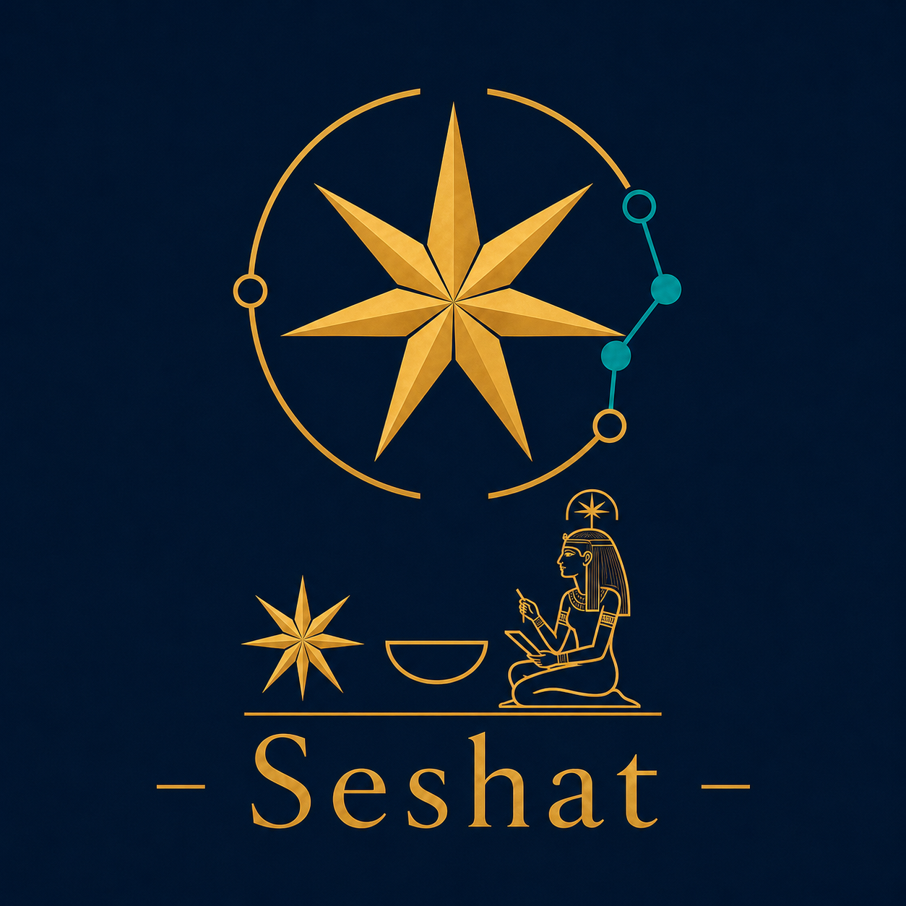
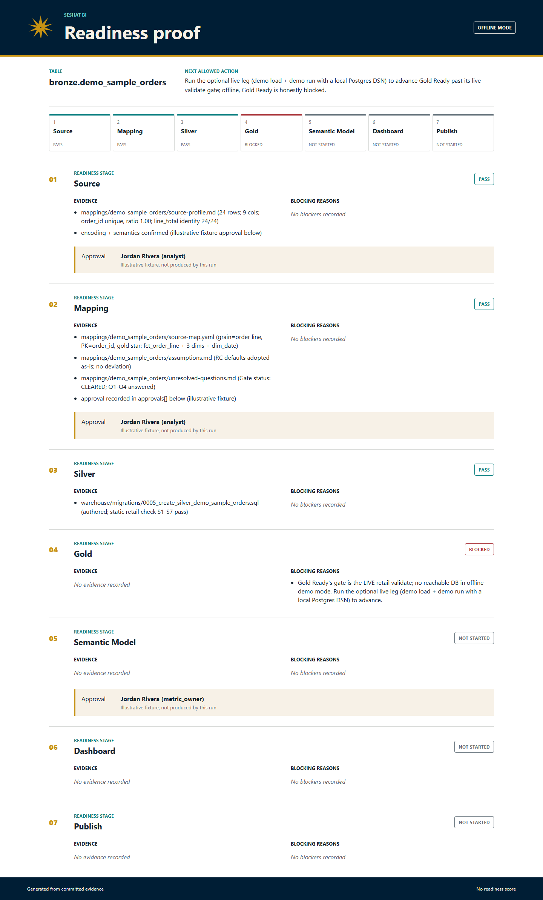
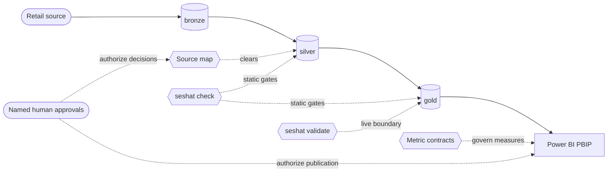

<div align="center">



# Seshat BI

### From messy retail data to trusted Power BI -- with evidence at every gate.

An agent-first readiness system that profiles sources, governs mappings, validates
the medallion warehouse, binds metrics to contracts, and prepares Power BI delivery
without skipping the human decisions that make analytics trustworthy.

[](https://pypi.org/project/seshat-bi/)
[](https://github.com/Kemetra/Seshat-BI/actions/workflows/ci.yml)
[](pyproject.toml)
[](LICENSE)
[](https://github.com/sponsors/Kemetra)
[](#how-it-works)
[](#how-it-works)

<br />

<a href="https://github.com/sponsors/Kemetra">
  
</a>
<br />
<sub>Fund open-source work on validation, compatibility, documentation, and agent safety.</sub>

<br /><br />

[**Run the demo**](#see-it-work) &nbsp;&middot;&nbsp;
[**Start contributing**](docs/contributing/first-contribution.md) &nbsp;&middot;&nbsp;
[**Sponsor a roadmap lane**](#sponsor-seshat-bi)

</div>

---

## Trust is a workflow, not a dashboard theme

A dashboard can look finished while its metrics are undefined, its source
assumptions are unsafe, and its totals have never been reconciled. Seshat BI makes
those gaps visible before they become executive decisions.

It answers one question:

> **Is this retail source ready to become trusted Power BI?**

The answer is never a made-up score. Readiness is recorded as
`status + evidence + blocking_reasons`, with named human approvals for judgment
calls such as grain, PII, business rollups, and publish safety.

Named for the ancient Egyptian figure of writing, measurement, and record keeping,
Seshat brings the same discipline to modern analytics: **map meaning, record
evidence, then build.**

## Seven gates between raw data and publication

Each stage can begin only after the prior stage passes. The sequence is the product.


| Before Seshat allows... | The evidence must show... |
|---|---|
| Silver transformation | Mapping Ready passed and the source map is cleared. |
| Power BI over gold | Live validation passed against the real data boundary. |
| Dashboard design | Metric contracts exist and define business meaning. |
| Power BI execution | Semantic Model Ready and the publish gates passed. |

> [!IMPORTANT]
> Seshat never self-grants an approval, invents source meaning, or turns a green
> static check into a claim of live semantic correctness.

## See it work

Try the bundled synthetic retail fixture. It needs no database and no Power BI
Desktop:

```bash
pipx install seshat-bi
seshat demo init
seshat demo run
seshat demo report --format html
```



The self-contained report shows evidence, blockers, approvals, and the next allowed
action across all seven stages. Offline proof stops honestly at **Gold Ready**;
advancing farther requires a live database boundary and governed downstream
artifacts.

## Why teams choose Seshat BI

| Principle | What it changes |
|---|---|
| **Evidence over scores** | Every pass cites evidence; every block names a concrete reason. |
| **Human judgment stays human** | Agents surface decisions but cannot approve grain, PII, rollups, or publication. |
| **Safe sequencing by construction** | The agent reads readiness state and performs only the next allowed action. |
| **Power BI consumes governed truth** | Reports read `gold`; measures trace to approved metric contracts. |

This makes Seshat useful to BI developers, analytics engineers, data engineers,
analytics leaders, and teams building agents that must stay truthful around real
business data.

## How it works



The agent is the interface. `seshat check` and `seshat validate` are gates the
agent calls; they are helpers, not the product experience.

### Choose your path

| You want to... | Start here |
|---|---|
| Evaluate Seshat in minutes | [Run the offline demo](#see-it-work) |
| Start a new BI workspace | `seshat init-project my-bi` |
| Adopt an existing PBIP project | `seshat adopt-pbip assess --project <path>` |
| Operate Seshat through an agent | [Agent Mode](docs/agent-mode.md) |
| Make your first contribution | [First-contribution path](docs/contributing/first-contribution.md) |

## What is built today

Seshat BI `v0.2.0` is an active beta on PyPI. The shipped system includes:

- **Static and live governance gates** over SQL, TMDL/PBIR, DAX, configuration,
  documentation, keys, date coverage, orphan relationships, and reconciliation.
- **Seven-stage agent control surfaces** through `seshat status` and `seshat next`,
  grounded in committed evidence rather than a separate run-state engine.
- **Governed source mapping and metric contracts** that stop transformation or
  dashboard work when business meaning is unresolved.
- **DAX governance and generation** through static rules, contract-drift checks,
  live value proxies, and verified measure generation.
- **Portable proof surfaces** including offline HTML, review JSON, SARIF, a GitHub
  Action, readiness passports, and an offline portfolio explorer.
- **A read-only MCP governor** that exposes governance state while refusing execution
  and approval by construction.
- **Governed extension packs** plus optional dbt and Dagster adapters that remain
  advisory and never create readiness truth.
- **Source-controlled Power BI workflows** with deterministic PBIR authoring helpers
  and a read-only assessment path for existing PBIP projects.

Explore the [capability inventory](docs/capabilities/capabilities.yaml),
[release notes](RELEASE_NOTES.md), and [roadmap](docs/roadmap/roadmap.md) for the
evidence behind each claim.

> [!WARNING]
> The Power BI execution adapter is deliberately deferred and gated. Building the
> final approved page in Power BI Desktop remains a named human action. Neither is
> presented as an available automated capability.

## Install

### Python CLI

```bash
pipx install seshat-bi
seshat init-project my-bi
```

The `seshat` command is primary. `retail` is a deprecated compatibility alias kept
for one deprecation cycle. Live database validation needs the optional `db` extra
and a DSN stored only in a gitignored `.env`.

### Claude Code plugin

```text
/plugin marketplace add Kemetra/Seshat-BI
/plugin install seshat-bi@seshat-bi-marketplace
```

### Codex plugin

```text
codex plugin marketplace add https://github.com/Kemetra/Seshat-BI
codex plugin add seshat-bi@seshat-bi-repository
```

Detailed setup: [user install](docs/install/user-install.md) |
[agent install](docs/install/agent-install.md) |
[support matrix](docs/install/support-matrix.md)

## Contributing

You do not need to learn the whole readiness system before making a useful first
contribution. Seshat provides bounded lanes with owned files, forbidden scope,
acceptance evidence, and exact verification commands.

| Starter lane | A useful contribution |
|---|---|
| KPI contract templates | Clarify reusable business definitions without inventing policy. |
| Synthetic fixtures | Add realistic, disclosure-safe test cases. |
| Dialect notes | Document compatibility behavior across supported databases. |
| Accessibility checks | Improve dashboard and documentation usability. |
| Blocker explanations | Make governance findings clearer and more actionable. |

1. Read the [first-contribution guide](docs/contributing/first-contribution.md).
2. Pick one lane from [contribution-lanes.yaml](docs/contributing/contribution-lanes.yaml).
3. [Claim a starter contribution](https://github.com/Kemetra/Seshat-BI/issues/new?template=starter.yml).
4. Follow the setup and pull-request checks in [CONTRIBUTING.md](CONTRIBUTING.md).

Contributions are especially welcome in governance rules, database compatibility,
synthetic fixtures, documentation, Power BI artifacts, and agent workflows.

## Sponsor Seshat BI

Trusted BI infrastructure is public-interest work: the rules, examples, tests, and
documentation should remain inspectable by the teams that depend on them.
Sponsorship can accelerate public, evidence-backed roadmap lanes such as:

- database compatibility and live-validation evidence,
- reproducible demo fixtures and cross-engine coverage,
- documentation, onboarding, accessibility, and contributor support,
- agent-safety research around analytics approvals and disclosure boundaries.

**The guardrail is simple:** funding supports the work; it never buys a readiness
approval, a rule exception, or an undisclosed product claim.

[**Sponsor Seshat BI through GitHub Sponsors**](https://github.com/sponsors/Kemetra)
&nbsp;&middot;&nbsp;
[**Discuss a public roadmap sponsorship**](https://github.com/Kemetra/Seshat-BI/issues/new?title=%5Bsponsorship%5D%20Sponsor%20a%20public%20roadmap%20lane)

For organization-level sponsorships or roadmap discussions, use the issue link only
for non-confidential context. Do not post procurement, client, or payment information
in a public issue.

## Repository guide

<details>
<summary><b>Where the system lives</b></summary>

| Path | Responsibility |
|---|---|
| `AGENTS.md` | Short operating contract and hard stops for agents. |
| `.specify/` | Constitution and feature specifications. |
| `src/seshat/` | CLI, governance rules, validation, and agent-facing surfaces. |
| `mappings/` | Per-table profiles, source maps, decisions, metrics, and readiness. |
| `warehouse/` | Tool-agnostic bronze, silver, and gold SQL artifacts. |
| `powerbi/` | Source-controlled PBIP semantic models and reports. |
| `templates/` | Generic readiness, mapping, metric, dashboard, and handoff blanks. |
| `skills/` | Canonical BI reasoning and workflow knowledge. |
| `docs/` | Architecture, readiness, operations, guides, and worked examples. |
| `tests/` | Unit, integration, contract, and optional live-database evidence. |

</details>

### Essential documentation

| Topic | Guide |
|---|---|
| Readiness model | [The seven-stage spine](docs/readiness/readiness-model.md) |
| Architecture | [Readiness pipeline](docs/architecture/readiness-pipeline.md) |
| Agent operation | [Agent Mode](docs/agent-mode.md) |
| Existing PBIP adoption | [Read-only adoption workflow](docs/tools/pbip-adoption.md) |
| Governance vocabulary | [Glossary and rule catalog](docs/glossary.md) |
| Frequently asked questions | [FAQ](docs/faq.md) |
| Product direction | [Roadmap](docs/roadmap/roadmap.md) |
| Release history | [Changelog](CHANGELOG.md) |
| Brand system | [Visual identity](docs/brand/visual-identity.md) |

## Deliberate boundaries

Seshat BI is a governed Retail BI factory, not a one-click dashboard generator, a
Fabric deployment platform, a universal ERP connector, or an automated approval
engine. New automation is valuable only when it strengthens one readiness stage
without taking a decision away from its accountable human owner.

## License

Seshat BI is available under the [Apache License 2.0](LICENSE).

<div align="center">

<br />

**Governed knowledge. Measured structure. Trusted BI.**

<sub>Seshat BI -- built in public for analytics people who would rather stop a bad number than decorate it.</sub>

</div>
