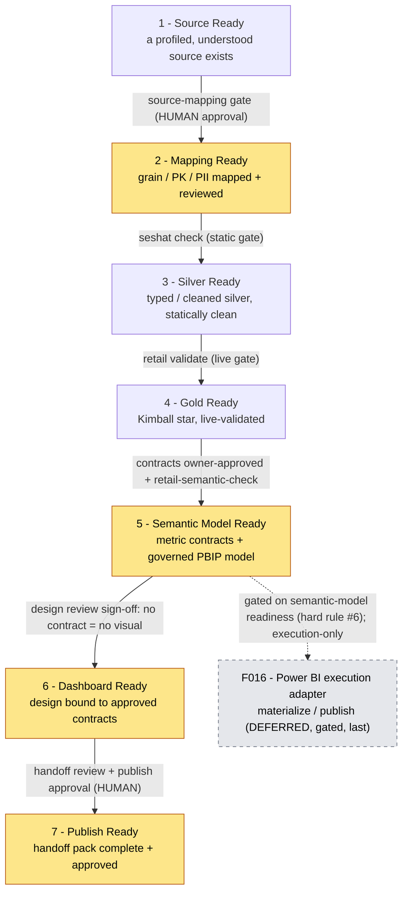
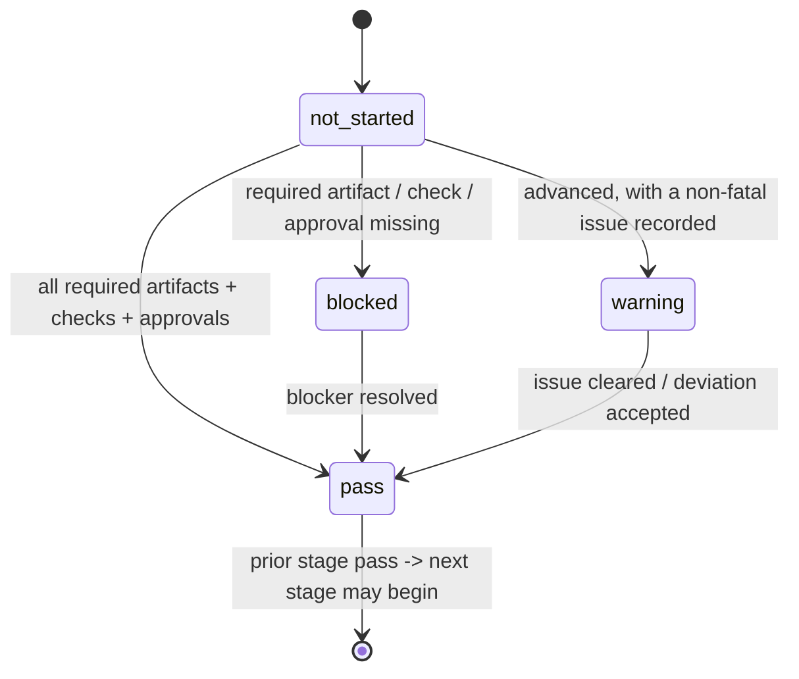

# The Readiness System -- the model

- **Status:** Shipped -- the seven-stage spine (F005-F015) is on `main`; this
  doc is its model. (The spine is docs/templates/skills by design, hard rule #8;
  it adds no runtime validator beyond `seshat check` / `retail validate`.)
- **What it is:** the **operating spine** inside Seshat BI. It does
  NOT replace the constitution, the medallion playbook, the source-mapping gate,
  or `seshat check` -- it **organizes them into stage-based readiness state** the
  agent reads to decide the next allowed action.

## Why a readiness spine

The kit already has the gates (mapping gate, `seshat check`, `retail validate`).
What it lacks is a single, legible answer to "where is this table, and what is
the one next thing allowed?" The readiness spine is that answer -- a **state
model**, not a new gate. It turns the existing gates into a tracked sequence.

## The spine at a glance (diagram)

The seven stages, the gate enforced on each transition, and the **human-approval seams**
(the agent never self-grants these -- Principle V). A stage is entered only when the prior
stage is `pass`. Four stages require a named-human approval recorded in `approvals[]`
(highlighted); `Silver Ready` and `Gold Ready` are mechanical gates with no stage
approval. Each `approvals[].owner` records the DECIDER by NAME plus the authority
class in parentheses (e.g. `"Ahmed Shaaban (data_owner)"`), so the approval traces
to a named human -- a bare role token alone is a defect (audit C4). RS1 enforces the
FULL shape: an owner that is a bare role, a name with no class, or an unknown class
is flagged AND does not satisfy the stage's approval requirement -- a legacy
`owner: data_owner` entry cannot keep an approval-required stage green.



> The highlighted stages each require a **named-human approval** the agent cannot grant
> for itself, recorded in `approvals[]`: `Mapping Ready` (mandatory gate sign-off),
> `Semantic Model Ready` (metric owner approves the contracts), `Dashboard Ready` (report
> owner signs off the visual->contract binding), and `Publish Ready` (data-owner/governance
> publish approval). `Silver Ready` and `Gold Ready` are mechanical gates (`seshat check` /
> `retail validate`) with no stage approval. `Source Ready` additionally needs the data
> owner to confirm the proposed semantics + any PII ruling before it is `pass`. `F016` is
> the deliberately-last, execution-only Power BI adapter -- gated on Semantic Model Ready,
> a prerequisite of no stage (it materializes/publishes an already-approved model; it
> cannot define meaning).

Each stage's status is one of four values; `blocked` stops the next stage, `warning` does
not:



## The state model

Each source/table/report carries a **readiness status** (see
`templates/readiness-status.yaml`) with one record per stage. A stage status is
one of four values -- never a fabricated number:

| Status | Meaning |
|--------|---------|
| `not_started` | the stage has not begun; prior stage may not be `pass` yet |
| `blocked` | a required artifact, check, or approval is missing -- see `blocking_reasons` |
| `warning` | advanced but with a non-fatal issue recorded (a static WARN, an accepted deviation) |
| `pass` | all required artifacts exist, all required checks pass, approvals are recorded |

A stage may be entered only when the **prior stage is `pass`** (see
`readiness-pipeline.md`). `warning` does not block the next stage by itself; a
`blocked` does.

## No fake confidence (the scoring rule)

Readiness is **explicit status + evidence + blockers**, not a confidence score.

- `evidence[]` lists the committed artifacts/check-runs that justify a `pass`.
- `blocking_reasons[]` lists the concrete reasons a stage is `blocked`.
- A `pass` with no evidence is a defect.
- **Numeric scores are OPTIONAL and DEFERRED.** If a `score` field is used it
  MUST be marked optional and MUST cite the evidence it derives from. Scoring
  rules are not defined yet; until they are, do not emit a number that reads as
  confidence. Prefer the four explicit statuses.

## What every stage doc defines

Each `docs/readiness/<stage>-ready.md` defines, in this shape:

- **Purpose** -- what "ready" means at this stage.
- **Required artifacts** -- the committed files that must exist.
- **Required checks** -- the gate(s) that must pass (`seshat check`,
  `retail validate`, an artifact review).
- **Statuses** -- what `not_started` / `blocked` / `warning` / `pass` mean here.
- **Blocking reasons** -- the concrete reasons this stage is `blocked`.
- **Required owner / approval** -- who must sign off, if anyone.
- **Next allowed action** -- the single next step when the stage passes.
- **What the agent must NOT do** -- the actions forbidden at this stage.

## One short example (readiness-status)

A minimal, generic instance (full schema in `templates/readiness-status.yaml`):

```yaml
table: <schema>.<table>          # generic; not a C086 value
source_family: <source_system>
current_stage: mapping_ready
stages:
  source_ready:   { status: pass,    evidence: ["mappings/<table>/source-profile.md"] }
  mapping_ready:  { status: blocked,  blocking_reasons: ["grain not confirmed unique on data"] }
  silver_ready:   { status: not_started }
  gold_ready:     { status: not_started }
  semantic_ready: { status: not_started }
  dashboard_ready:{ status: not_started }
  publish_ready:  { status: not_started }
approvals: []                    # e.g. {stage: mapping_ready, owner: "Ada Lovelace (analyst)", at: <date>}
next_action: "resolve the open grain question in mappings/<table>/unresolved-questions.md"
last_checked_at: "<YYYY-MM-DD>"
checked_by: "<agent | person>"
```

## What the agent does with the spine

- Reads the readiness status to find `current_stage` and `next_action`.
- Launches the workflow for that stage only -- never skips ahead.
- On a gate failure, records `blocked` + `blocking_reasons`, and STOPS.
- Never writes a `pass` it cannot back with `evidence`.
- Never fabricates a score.

## See also

- The stage sequence + transitions: `readiness-pipeline.md`.
- The seven stages: `source-ready.md`, `mapping-ready.md`, `silver-ready.md`,
  `gold-ready.md`, `semantic-model-ready.md`, `dashboard-ready.md`,
  `publish-ready.md`.
- Templates: `templates/readiness-status.yaml`, `readiness-scorecard.md`,
  `blocking-reasons.md`, `data-issues.md`,
  `handoff/bi-handoff-pack.md`, `handoff/handoff-review-checklist.md`.
- Constitution principles this reinforces: I (Agent-First), IV (Source Mapping
  Before Silver), V (Agent Stops at Judgment Calls), VIII (Static-First).
