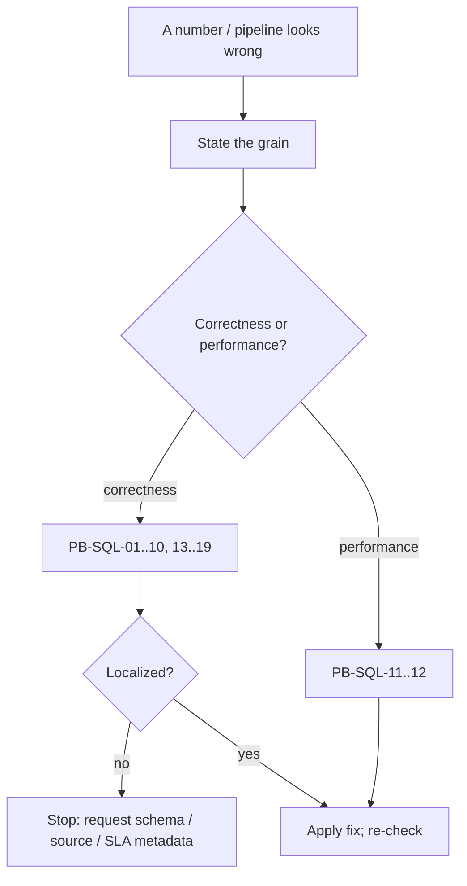

# SQL Diagnostics -- Consolidated Playbook

> Symptom-driven reference: state the grain, then route to a playbook (PB-SQL-01..19). Each entry: symptom -> likely cause -> first checks -> SQL probe -> fix options -> stop rule -> escalation. Original retail framing. See `../references/source-map.md`.

**Golden first move for any symptom:** *state the grain of the offending query in one sentence
("one row of this result is one ___").* Most failures reveal themselves the moment grain is named.

---

## PB-SQL-01 -- "My total doubled / inflated"
- **Likely cause:** fan-out -- a one-to-many (or unverified) join multiplied rows before the SUM.
- **Checks:** `COUNT(*)` before vs after each join; uniqueness-check the right-side key
  (`GROUP BY key HAVING COUNT(*)>1`).
- **Fix:** aggregate to grain before joining, or join to a one-row-per-key summary; never patch with
  `DISTINCT`.
- **Stop & ask:** if you can't confirm key uniqueness from a sample -> request PK/cardinality metadata.
- **Links:** SC-007, SC-010, SC-011 - SQL-AP-005, SQL-AP-013, SQL-AP-010.

## PB-SQL-02 -- "Row count changed after a join"
- **Likely cause:** the join isn't the many-to-one you assumed (duplicate right-side key), or null
  keys / inner-vs-left mismatch.
- **Checks:** `COUNT(*)` base vs joined; duplicate-key check on the right side; count null/unmatched keys.
- **Fix:** dedup the right side to one row per key, or change the join grain deliberately and
  re-declare grain.
- **Stop & ask:** if uniqueness can't be determined from data -> request key constraints.
- **Links:** SC-009, SC-010, SC-014 - SQL-AP-012, SQL-AP-015.

## PB-SQL-03 -- "COUNT is lower / higher than expected"
- **Likely cause:** `COUNT(col)` skipping nulls, `COUNT(DISTINCT)` collapsing dupes, or `COUNT(*)`
  counting rows not entities.
- **Checks:** compare `COUNT(*)`, `COUNT(col)`, `COUNT(DISTINCT col)` side by side; count nulls.
- **Fix:** pick the count form matching the question; `COALESCE`/include nulls if they should count.
- **Stop & ask:** if it's unclear whether nulls are valid business cases (e.g. guest checkout) ->
  confirm semantics.
- **Links:** SC-006, SC-008 - SQL-AP-004.

## PB-SQL-04 -- "The average looks wrong"
- **Likely cause:** AVG of averages (unweighted), or `AVG` excluding nulls from the denominator.
- **Checks:** recompute as `SUM(x)/SUM(n)` from base grain; compare `AVG(col)` vs `AVG(COALESCE(col,0))`.
- **Fix:** average from base grain or weight by group size; decide null treatment explicitly.
- **Stop & ask:** if the intended denominator (all rows vs non-null) is a business decision -> confirm.
- **Links:** SC-008 - SQL-AP-006.

## PB-SQL-05 -- "Can't filter on an aggregate / window (query errors)"
- **Likely cause:** aggregate condition in `WHERE`, or a window function in `WHERE`/`HAVING`
  (logical processing order).
- **Checks:** is the value computed at GROUP BY (-> HAVING) or at SELECT (window -> outer query)?
- **Fix:** move aggregate conditions to `HAVING`; compute windows in a CTE and filter in an outer query.
- **Links:** SC-002, SC-020 - SQL-AP-007, SQL-AP-019.

## PB-SQL-06 -- "Running total / ranking is nondeterministic or jumps"
- **Likely cause:** non-deterministic `ORDER BY` (ties), or the default `RANGE` frame on a non-unique
  order column.
- **Checks:** is the OVER `ORDER BY` total (has a tiebreak)? is there an explicit `ROWS` frame?
- **Fix:** add a tiebreak; use `ROWS BETWEEN UNBOUNDED PRECEDING AND CURRENT ROW` for running totals.
- **Links:** SC-016, SC-017, SC-018 - SQL-AP-016, SQL-AP-017.

## PB-SQL-07 -- "Trend missing periods / YoY-MoM is wrong"
- **Likely cause:** trending off a sparse fact (missing periods), `LAG` reading previous *row* not
  previous *period*, or `BETWEEN` on a timestamp dropping the end day.
- **Checks:** is the series anchored on a date spine? are ranges half-open? are periods comparable
  lengths?
- **Fix:** LEFT JOIN the date spine (COALESCE zeros); use half-open ranges; compare like-for-like.
- **Stop & ask:** if the business "day"/time zone or SLA is unknown -> confirm before bucketing.
- **Links:** SC-021, SC-023, SC-024, SC-025 - SQL-AP-021, SQL-AP-022, SQL-AP-025, SQL-AP-026.

## PB-SQL-08 -- "Gold totals don't reconcile to source"
- **Likely cause:** grain drift between layers (a fan-out join, an un-deduped source, a masking
  GROUP BY) so a control total diverges.
- **Checks:** pick a control total (revenue, distinct orders) at a shared grain; compare source ->
  silver -> gold; find the first layer that diverges.
- **Fix:** repair the transformation at the first divergence; add a reconciliation gate there.
- **Stop & ask:** if the authoritative source figure is disputed -> request it.
- **Links:** SC-005, SC-030 - SQL-AP-029, SQL-AP-030 - VP-CONTROLTOTAL, VP-ROWCOUNT.

## PB-SQL-09 -- "All gates pass but data is stale / a segment is missing"
- **Likely cause:** no freshness/completeness gate; completeness checked off the fact, not a spine.
- **Checks:** `MAX(date)` vs SLA; date-spine LEFT JOIN to find periods with zero rows; expected-segment list.
- **Fix:** add recency + spine-based completeness gates.
- **Stop & ask:** if the SLA or expected volume/segments aren't defined -> request them.
- **Links:** SC-031, SC-023 - SQL-AP-032 - VP-FRESHNESS, VP-COMPLETENESS.

## PB-SQL-10 -- "A reload doubled the data"
- **Likely cause:** non-idempotent load (append instead of replace/merge); dedup not verified.
- **Checks:** `COUNT(*)` = `COUNT(DISTINCT key)`? does re-running keep row count and control totals
  identical?
- **Fix:** make the load replace/merge; add a dedup/idempotency gate.
- **Links:** SC-032, SC-013 - SQL-AP-031 - VP-DEDUP.

## PB-SQL-11 -- "Query is slow but correct"
- **Likely cause:** scanning too many rows/columns, or non-sargable predicates.
- **Checks:** can filters run before joins/aggregates? is `SELECT *` used? are predicates sargable
  (bare column, no leading wildcard)?
- **Fix:** filter early; select only needed columns; unwrap columns in predicates; let the smallest
  set drive the joins.
- **Stop & note:** exact tuning (indexes, partitioning, distribution keys) is engine-specific -- a
  later, engine-aware phase.
- **Links:** SC-033, SC-034, SC-035, SC-036, SC-037 - SQL-AP-033, SQL-AP-035, SQL-AP-037.

## PB-SQL-12 -- "Can't tell if a deep CTE query is right"
- **Likely cause:** grain not tracked across the CTE stack; fan-out hidden in the middle.
- **Checks:** annotate each CTE with its grain; find where a join fans out or a GROUP BY collapses.
- **Fix:** declare grain per CTE; fix the step where grain unexpectedly changed.
- **Links:** SC-038, SC-005 - SQL-AP-036, SQL-AP-034.

## PB-SQL-13 -- "Two tables should match but don't / a set op returns unexpected rows"
- **Likely cause:** column lists differ or are misordered (set ops match by position, SC-039);
  `UNION` silently deduped where `UNION ALL` was meant (SC-040); a one-directional `EXCEPT` assumed
  to prove equality (SC-042); null-equality differs under set ops vs `=`.
- **First checks:** confirm both sides project the same columns, same order, same types; run `EXCEPT`
  **both** directions; compare `COUNT(*)`; look for duplicate-count differences.
- **SQL probe:** `SELECT <cols> FROM a EXCEPT SELECT <cols> FROM b;` then the reverse; equal iff both
  return 0 rows **and** `COUNT(*)` matches.
- **Fix options:** align projections; use `UNION ALL` unless dedup is intended; gate equality on both
  directions + counts (VP-DIFF).
- **Stop rule:** if the column set that defines "the same row" isn't agreed -> confirm the row-identity
  keys before asserting (in)equality.
- **Escalation / routing:** stays in `bi-sql-knowledge`. Links SC-039..042 - SQL-AP-038..041 - VP-DIFF.

## PB-SQL-14 -- "A reload changed row counts / an upsert duplicated rows"
- **Likely cause:** non-idempotent append load (SC-047, SC-032); `MERGE` on a non-unique key;
  `UPDATE` with a missing/loose `WHERE` (SC-045); dedup-delete with no keep rule (SC-046).
- **First checks:** is the load `MERGE`/replace or plain `INSERT`? is the merge/update key unique
  (SC-010)? does re-running keep `COUNT(*)` and control totals identical?
- **SQL probe:** `SELECT COUNT(*), COUNT(DISTINCT <key>) FROM target;` (equal = no dup); re-run the
  load and re-compare row count + a control total.
- **Fix options:** switch to `MERGE`/replace keyed on a verified-unique key; scope the `WHERE`; choose
  a deterministic survivor for dedup (SC-013).
- **Stop rule:** if the business key for the merge isn't confirmed unique -> request key metadata.
- **Escalation / routing:** stays here. Links SC-044..048, SC-032 - SQL-AP-042..045 - VP-DEDUP,
  VP-CONTROLTOTAL.

## PB-SQL-15 -- "Subtotals / grand totals look wrong or duplicated"
- **Likely cause:** hand-`UNION`-ed aggregations out of sync (SC-051); subtotal NULLs read as a real
  category (SC-052); a downstream consumer summing a result that already contains ROLLUP subtotals
  (double counting); equal-width buckets assumed equal-count (SC-053).
- **First checks:** is one `ROLLUP`/`GROUPING SETS` used? are subtotal rows flagged with `GROUPING()`?
  does any downstream step re-aggregate a result that includes subtotals?
- **SQL probe:** `... GROUP BY ROLLUP (region, store_key)` with
  `CASE WHEN GROUPING(region)=1 THEN 'All' ... END` to label/inspect subtotal rows.
- **Fix options:** produce levels with `ROLLUP`/`GROUPING SETS`; label subtotal rows; never feed
  subtotal-bearing output into another `SUM` without filtering them out.
- **Stop rule:** if the required subtotal levels aren't specified -> confirm the report's level set.
- **Escalation / routing:** stays here. Links SC-049..053 - SQL-AP-046..049.

## PB-SQL-16 -- "Groups split by case/whitespace; a join misses obvious matches"
- **Likely cause:** keying on un-normalized text (SC-054); a multi-valued field matched with `LIKE`
  instead of split to rows (SC-055); unparseable values from a hard `CAST` (SC-058).
- **First checks:** are text keys trimmed/case-folded/unaccented before group/join? is a multi-value
  field exploded to rows? does a cast have garbage inputs?
- **SQL probe:** `SELECT UPPER(TRIM(name)), COUNT(*) FROM t GROUP BY UPPER(TRIM(name));` to see merged
  groups; `WHERE col !~ '<expected pattern>'` to find dirty values.
- **Fix options:** canonicalize keys (or use surrogate keys); split delimited fields to rows; use
  safe parsing (`TRY_CAST`) + a quarantine flag.
- **Stop rule:** if the canonical form (which variant is "correct") is a business decision -> confirm.
- **Escalation / routing:** stays here. Links SC-054..058 - SQL-AP-050..052.

## PB-SQL-17 -- "Missing dates in a trend / business-day count wrong / overlaps mis-detected"
- **Likely cause:** trending off the fact instead of a generated spine (SC-059, SC-060); counting
  calendar days as business days (SC-061); wrong overlap boundary logic (SC-062).
- **First checks:** is there a generated calendar LEFT-joined? does the duration use a working-day
  flag? is the overlap test the canonical `a_start < b_end AND b_start < a_end`?
- **SQL probe:** `SELECT c.d, COALESCE(SUM(...),0) FROM cal c LEFT JOIN sales s ON s.order_date=c.d
  GROUP BY c.d;` to expose empty periods.
- **Fix options:** generate + LEFT JOIN a date spine; use a working-day calendar; apply the canonical
  half-open overlap test.
- **Stop rule:** if the holiday calendar / business-day definition isn't provided -> request it.
- **Escalation / routing:** stays here. Links SC-059..063 - SQL-AP-053..055.

## PB-SQL-18 -- "Recursive query runs forever / islands wrong / gaps missed"
- **Likely cause:** recursive CTE with no termination or cycle guard (SC-066, SC-067); islands
  computed without a partition or deterministic order (SC-064); gaps sought only among present rows,
  not against a complete sequence (SC-065).
- **First checks:** does the recursive member have a stopping condition + cycle/depth guard? is the
  island key partitioned and deterministically ordered? are gaps detected against a complete
  sequence/spine?
- **SQL probe:** island key = `value - ROW_NUMBER() OVER (PARTITION BY ... ORDER BY ...)`, grouped;
  gap = `LEAD(x) OVER (ORDER BY x) - x > 1`.
- **Fix options:** add termination + cycle/depth guards; partition + order the island key; detect gaps
  via `LEAD`/anti-join against the full sequence.
- **Stop rule:** if the hierarchy might contain cycles or its max depth is unknown -> confirm/guard.
- **Escalation / routing:** stays here. Links SC-064..067 - SQL-AP-056..058.

## PB-SQL-19 -- "Validation doesn't scale / the schema drifted out from under our checks"
- **Likely cause:** hand-written per-column checks that go stale (SC-068); generated SQL with unquoted
  identifiers (SC-069); profiling only a subset of columns (SC-070).
- **First checks:** are checks generated from `information_schema`? are identifiers/literals quoted?
  is every in-scope column profiled with the same metrics?
- **SQL probe:** read `information_schema.columns` for the table; generate one
  `SELECT COUNT(*) ... WHERE <col> IS NULL` per column with `quote_ident`/`quote_literal`.
- **Fix options:** drive checks/profiles from the catalog; quote generated identifiers/literals;
  compare profiles across runs to catch drift.
- **Stop rule:** if "expected" schema/volumes/bounds aren't defined -> request the contract to compare
  against.
- **Escalation / routing:** stays here. Links SC-068..070 - SQL-AP-059..060 - VP-PROFILE.

---

## Escalation rule (applies to every entry)

When two cheap checks -- a `COUNT(*)` comparison and a uniqueness check -- can't localize the problem,
**stop and request schema/source metadata** (primary keys, expected grain, null semantics, SLA,
expected volumes) rather than guessing. Establishing these facts *is* the job of the SQL knowledge
layer; inventing them is not.

## Index -- symptom -> playbook

| Symptom | Playbook | Primary slice |
|---|---|---|
| total doubled / inflated | PB-SQL-01 | 1-2 |
| row count changed after join | PB-SQL-02 | 2 |
| COUNT off | PB-SQL-03 | 1 |
| average wrong | PB-SQL-04 | 1 |
| can't filter aggregate/window | PB-SQL-05 | 1, 3 |
| running total/rank nondeterministic | PB-SQL-06 | 3 |
| trend gaps / YoY-MoM wrong | PB-SQL-07 | 4 |
| gold != source | PB-SQL-08 | 5 |
| stale / missing segment | PB-SQL-09 | 5 |
| reload doubled data | PB-SQL-10 | 5 |
| slow but correct | PB-SQL-11 | 6 |
| deep CTE unclear | PB-SQL-12 | 6 |
| two tables should match but don't | PB-SQL-13 | C1 |
| reload changed counts / upsert duplicated | PB-SQL-14 | C2 |
| subtotals / grand totals wrong or duplicated | PB-SQL-15 | C3 |
| groups split by case/whitespace; join misses matches | PB-SQL-16 | C4 |
| missing dates / business-day / overlap wrong | PB-SQL-17 | C5 |
| recursive runs forever / islands / gaps | PB-SQL-18 | C6 |
| validation doesn't scale / schema drifted | PB-SQL-19 | C7 |
