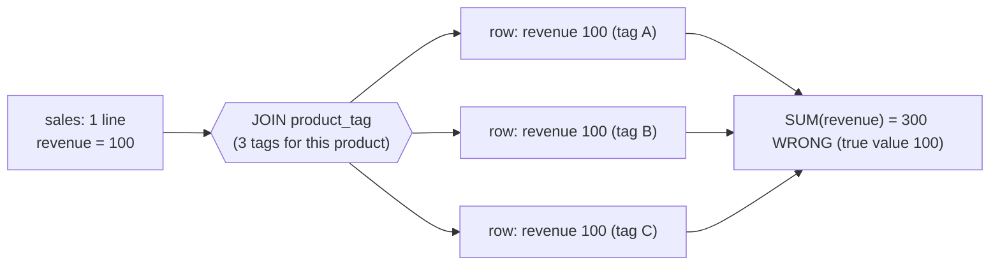

# SQL Grain & Joins

> Joins, cardinality, duplicate (fan-out) amplification, anti-joins, deduplication, NULLs in joins (SC-009..014). Original retail examples only; builds on SC-003/004/007/008. See `../references/source-map.md`.

## Slice 2 overview -- why this matters for Seshat BI

Slice 1 established that an aggregate is only correct relative to a known grain. Slice 2 covers the
operation that **silently breaks grain**: the join. Duplicate amplification ("fan-out") is the most
dangerous bug in BI SQL because the query succeeds and returns a confident, wrong number -- usually
too large. This slice gives the agent the reasoning to (1) predict a join's effect on grain *before*
running it, (2) verify cardinality with cheap checks, (3) choose correct dedup, and (4) handle the
null behavior that quietly drops or mismatches rows. It is the gate that makes silver/gold and every
downstream DAX measure trustworthy.

---

## Concept cards (continuing the Slice 1 set)

### SC-009 -- Join types and match semantics
- **Definition.** `INNER` keeps only matched rows; `LEFT` keeps all left rows (+ matches, nulls
  where unmatched); `RIGHT` the mirror; `FULL` keeps unmatched from both sides; a missing/`TRUE`
  join condition yields a `CROSS` join (every combination).
- **Why it matters.** The join type decides which rows survive and therefore the row count and the
  denominators of later aggregates. "Why did rows disappear / appear?" is usually a join-type
  question.
- **Common failure mode.** Using `INNER` where `LEFT` was meant (silently dropping unmatched sales),
  or an accidental cross join from a missing/incorrect condition.
- **Diagnostic question.** *"Which rows should survive if there's no match -- and does my join type
  reflect that?"*
- **Retail example.** `sales LEFT JOIN customer` keeps guest-checkout lines (null `customer_key`);
  an `INNER JOIN` would silently drop them and understate revenue.
- **Feeds.** SQL-AP-012, SQL-AP-015 - SARC-LEFTFILTER-01.

### SC-010 -- Join cardinality (1:1, 1:many, many:many) and verifying it
- **Definition.** A join's cardinality is set by uniqueness of the join key on each side. Dimension
  joins should be **many:1** (many `sales` -> one `product`). If the "one" side isn't unique, it's
  secretly **many:many** and rows multiply.
- **Why it matters.** Cardinality determines whether the join preserves grain or inflates it. It
  must be *verified*, not assumed (extends SC-004).
- **Common failure mode.** Believing `product_key` is unique in `product` without checking; joining
  to a table that has multiple rows per key.
- **Diagnostic question.** *"Is the key unique on the side I think is 'one'? Did `COUNT(*)` change
  after the join?"*
- **Retail example.** Verify before trusting: `SELECT product_key, COUNT(*) FROM product GROUP BY
  product_key HAVING COUNT(*) > 1;` -- empty result = safe many:1 join.
- **Feeds.** SQL-AP-010, SQL-AP-013 - SARC-FANOUT-01, SARC-M2M-01.

### SC-011 -- Duplicate (fan-out) amplification
- **Definition.** When you join to a table with more than one matching row per left row, each left
  row is **duplicated**, and any additive aggregate (`SUM`, `COUNT(*)`) computed afterward is
  **multiplied** by the number of matches.
- **Why it matters.** It's silent: no error, just an inflated total. It corrupts revenue, counts,
  and every metric built on them -- the #1 cause of "my total doubled."
- **Common failure mode.** `SUM(sales.quantity * sales.net_price)` after joining `sales` to a
  one-to-many table (tags, addresses, order events).
- **Diagnostic question.** *"Could this join produce more than one row per `sales` row? If so, my
  SUM is inflated."*
- **Retail example.** Below. Fix by aggregating to grain before joining, or joining to a
  one-row-per-key summary -- never by slapping on `DISTINCT` (SQL-AP-014).
- **Feeds.** SQL-AP-010, SQL-AP-013 - SARC-FANOUT-01.

### SC-012 -- Anti-joins and existence checks
- **Definition.** "Rows in A with no match in B." Three idioms: `NOT EXISTS` (safe with nulls),
  `LEFT JOIN ... WHERE b.key IS NULL` (safe), and `NOT IN (subquery)` (**unsafe** if the subquery can
  return a null).
- **Why it matters.** Anti-joins drive validation ("orphan facts with no matching dimension") and
  reconciliation ("rows present in source but missing in gold"). The `NOT IN`+null trap silently
  returns *zero rows*.
- **Common failure mode.** `WHERE customer_key NOT IN (SELECT customer_key FROM excluded)` returning
  nothing because `excluded` contains a null (three-valued logic, SC-008).
- **Diagnostic question.** *"Am I doing an anti-join, and could the compared set contain nulls?"*
- **Retail example.** Orphan check: `SELECT s.* FROM sales s LEFT JOIN product p ON p.product_key =
  s.product_key WHERE p.product_key IS NULL;` -- sales lines whose product is missing.
- **Feeds.** SQL-AP-011 - SARC-NOTIN-01.

### SC-013 -- Deduplication strategies
- **Definition.** Removing duplicate rows. `DISTINCT` (whole-row distinct), `GROUP BY` (one row per
  key, with aggregates), or **`ROW_NUMBER()` + filter** (keep a *chosen* survivor per key with an
  explicit tiebreak). Only the last is deterministic about *which* row survives.
- **Why it matters.** Silver/gold dedup must be deterministic and explainable; "make duplicates
  disappear" without choosing a survivor is not a transformation, it's hiding a problem.
- **Common failure mode.** `SELECT DISTINCT *` to suppress duplication (SQL-AP-014); deduping by key
  but leaving which row wins to chance.
- **Diagnostic question.** *"Which row should survive per key, and what's the deterministic
  tiebreak?"*
- **Retail example.** Keep the latest line per order: `ROW_NUMBER() OVER (PARTITION BY order_id
  ORDER BY order_line_id DESC)` then `WHERE rn = 1` (see Slice 1 LQP note).
- **Feeds.** SQL-AP-014 - SARC-DEDUP-01.

### SC-014 -- NULLs in joins and filters
- **Definition.** A `NULL` join key matches **nothing** (not even another null). In filters, a
  predicate on a null yields `UNKNOWN`, so the row is excluded. `NULL = NULL` is unknown, not true.
- **Why it matters.** Null keys silently drop rows from inner joins and from `WHERE`; this changes
  counts and denominators without warning. Critical for honest validation.
- **Common failure mode.** Expecting null-keyed `sales` lines to join; expecting `WHERE col <> 'x'`
  to keep null `col` rows (it drops them).
- **Diagnostic question.** *"Do any join keys or filtered columns contain nulls, and is the row
  drop intended?"*
- **Retail example.** Guest-checkout lines (`customer_key IS NULL`) vanish from `sales INNER JOIN
  customer`; use `LEFT JOIN` (SC-009) or handle nulls explicitly (`COALESCE`).
- **Feeds.** SQL-AP-011, SQL-AP-012 - SARC-NOTIN-01, SARC-NULL-01 (Slice 1).

---

## How fan-out happens (the picture)



One sales line became three; the SUM tripled. No error was raised.

## Original retail examples

**1. Verify cardinality before joining (the cheap insurance).**
```sql
-- Is product_key safe as a many:1 join key? Empty result = yes.
SELECT product_key, COUNT(*) AS n FROM product GROUP BY product_key HAVING COUNT(*) > 1;

-- Did the join change the row count? (run base vs joined)
SELECT COUNT(*) FROM sales;                                   -- base grain
SELECT COUNT(*) FROM sales s JOIN product p ON p.product_key = s.product_key;  -- should match
```

**2. Fan-out, and the correct fix.**
```sql
-- WRONG: many tags per product inflate revenue
SELECT p.category, SUM(s.quantity * s.net_price) AS revenue
FROM sales s
JOIN product p     ON p.product_key = s.product_key
JOIN product_tag t ON t.product_key = p.product_key       -- one-to-many -> fan-out
GROUP BY p.category;

-- RIGHT: keep sales at its grain; bring category from the unique product row only
SELECT p.category, SUM(s.quantity * s.net_price) AS revenue
FROM sales s
JOIN product p ON p.product_key = s.product_key            -- verified many:1
GROUP BY p.category;
-- If tags are truly needed, pre-aggregate tags to one row per product before joining.
```

**3. Anti-join: NOT IN trap vs safe forms.**
```sql
-- UNSAFE: returns NOTHING if `excluded_customer` has any NULL customer_key
SELECT * FROM sales WHERE customer_key NOT IN (SELECT customer_key FROM excluded_customer);

-- SAFE: NOT EXISTS
SELECT s.* FROM sales s
WHERE NOT EXISTS (SELECT 1 FROM excluded_customer e WHERE e.customer_key = s.customer_key);
```

**4. LEFT JOIN turned into an INNER JOIN by a WHERE filter (a classic trap).**
```sql
-- BUG: filtering the right table in WHERE drops the unmatched (null) rows -> effectively INNER
SELECT s.* FROM sales s
LEFT JOIN store st ON st.store_key = s.store_key
WHERE st.region = 'West';          -- null st.region (unmatched) fails the test -> rows dropped

-- FIX: put the right-table condition in the ON clause (keeps unmatched sales)
SELECT s.* FROM sales s
LEFT JOIN store st ON st.store_key = s.store_key AND st.region = 'West';
```

**5. Deterministic dedup (choose the survivor).**
```sql
WITH ranked AS (
  SELECT s.*, ROW_NUMBER() OVER (PARTITION BY order_id ORDER BY order_line_id DESC) AS rn
  FROM sales s
)
SELECT * FROM ranked WHERE rn = 1;   -- one explicit survivor per order_id
```

---

## Slice 2 diagnostic mini-playbook

- **"Total inflated / doubled after a join"** -> suspect fan-out (SC-011). Check `COUNT(*)` before vs
  after; uniqueness-check the right-side key (SC-010). Fix grain, don't `DISTINCT` it.
- **"Rows disappeared after a join"** -> INNER where LEFT was needed, or null join keys (SC-009,
  SC-014). Count unmatched keys; switch to `LEFT JOIN` or handle nulls.
- **"My LEFT JOIN dropped rows anyway"** -> a right-table predicate in `WHERE` (SQL-AP-012). Move it
  to `ON`.
- **"Anti-join returns nothing"** -> `NOT IN` with a null in the subquery (SC-012). Use `NOT EXISTS`.
- **Stop & request metadata when** you can't confirm key uniqueness from a sample -- ask for PK /
  cardinality metadata before trusting the join.

## Feeds

- Concepts: SC-009...SC-014 (extend SC-003, SC-004, SC-007, SC-008).
- Anti-patterns: SQL-AP-010...SQL-AP-015.
- Analyzer candidates: SARC-FANOUT-01, SARC-M2M-01, SARC-NOTIN-01, SARC-LEFTFILTER-01, SARC-DEDUP-01.
