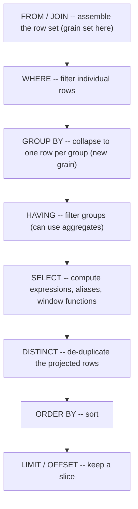

# Logical Query Processing (SC-002 deep dive)

> Clause evaluation order and its consequences. Distilled, original framing; original retail examples only. See `../references/source-map.md`.

## The order that actually matters

You **write** SQL as `SELECT ... FROM ... WHERE ... GROUP BY ... HAVING ... ORDER BY`, but the engine
**evaluates** it in a different logical order. Knowing that order explains most "why won't this
work?" moments.



## Five consequences an agent should internalize

1. **`WHERE` filters rows; `HAVING` filters groups.** Aggregate conditions (`SUM(...) > 100`,
   `COUNT(*) > 5`) belong in `HAVING`, because groups don't exist yet at the `WHERE` step.
2. **`SELECT` aliases don't exist in `WHERE`/`GROUP BY`/`HAVING`.** They're created at the `SELECT`
   step, which runs *after* those. Repeat the expression, or wrap in a subquery/CTE.
3. **Window functions are computed at `SELECT`** -- so they can't appear in `WHERE` or `HAVING`. To
   filter on a window result (e.g. "rows where row_number = 1"), compute it in a subquery/CTE and
   filter in an outer query.
4. **Grain is set at `FROM`/`JOIN` and reset at `GROUP BY`.** A join can inflate grain *before*
   `WHERE` even runs; grouping then re-defines it. Track grain across these steps (see
   [SC-003], [SC-007]).
5. **`DISTINCT` runs after `SELECT`.** Using it to "clean up" duplicates hides a grain problem
   created earlier rather than fixing it (see SQL-AP-009).

## Original retail examples

**WHERE vs HAVING.** "Stores with more than 1,000 orders":

```sql
-- correct: filter the group
SELECT store_key, COUNT(DISTINCT order_id) AS orders
FROM sales
GROUP BY store_key
HAVING COUNT(DISTINCT order_id) > 1000;
```

`WHERE COUNT(DISTINCT order_id) > 1000` is invalid -- the count doesn't exist at the `WHERE` step.

**Alias not available early.** This fails because `revenue` is created at `SELECT`:

```sql
-- INVALID
SELECT store_key, SUM(quantity * net_price) AS revenue
FROM sales
GROUP BY store_key
HAVING revenue > 50000;          -- alias not visible to HAVING in standard SQL
```

Fix by repeating the expression in `HAVING`, or wrap in a CTE and filter outside.

**Filtering on a window function.** "Keep only the latest line per order" needs two steps:

```sql
WITH ranked AS (
  SELECT s.*,
         ROW_NUMBER() OVER (PARTITION BY order_id ORDER BY order_line_id DESC) AS rn
  FROM sales s
)
SELECT * FROM ranked WHERE rn = 1;   -- the window result is filtered in the OUTER query
```

You cannot put `WHERE ROW_NUMBER() OVER (...) = 1` in the inner query -- windows are computed at
`SELECT`, after `WHERE`.

## Feeds

- Anti-pattern: **SQL-AP-007** (aggregate filtered in `WHERE`).
- Analyzer candidate: **SARC-HAVING-01**.
- Concept: **SC-002**; supports grain reasoning (**SC-003**, **SC-005**).
