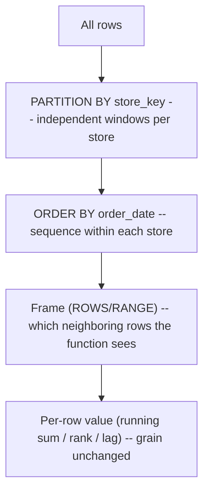

# SQL Window Functions

> OVER / PARTITION BY / ORDER BY / frames; ranking, running totals, LAG/LEAD, dedup-by-row_number (SC-015..020). Original retail examples only. See `../references/source-map.md`.

## Slice 3 overview -- why this matters for Seshat BI

Window functions are the engine behind most analytical SQL and a lot of silver/gold logic: running
totals, period-over-period change, ranking, "latest record per key" dedup, and cohort math. Their
defining property -- **compute across a set of related rows without collapsing them** -- is exactly
what `GROUP BY` can't do. For Seshat BI they matter because (a) they produce the analytics layer,
(b) they're the deterministic way to dedup (SC-013), and (c) their subtle defaults (frames, ties,
sparse dates) are a rich source of silent wrong numbers an agent must reason about.

**The one-line mental model:** a window function keeps every input row and attaches a value computed
over a *window* of rows defined by `OVER (PARTITION BY ... ORDER BY ... <frame>)`.

---

## Concept cards (continuing SC-001...014)

### SC-015 -- What a window function is (vs GROUP BY)
- **Definition.** A function evaluated over a set of rows (the "window") defined by `OVER(...)`,
  which returns a value **per row without collapsing rows**. `GROUP BY` collapses to one row per
  group; a window keeps the original grain and adds a column.
- **Why it matters.** Lets you show a row *and* its context (its share of the total, its rank, the
  running sum) in one pass -- without a self-join and without losing detail.
- **Common failure mode.** Reaching for a `GROUP BY` + join when a window is cleaner; or assuming a
  window collapses rows (it doesn't).
- **Diagnostic question.** *"Do I need per-row detail alongside a group-level value? Then it's a
  window, not a GROUP BY."*
- **Retail example.** Each line's share of its order's revenue, keeping every line:
  `SUM(quantity*net_price) OVER (PARTITION BY order_id)` as the denominator.
- **Feeds.** SQL-AP-020 - SARC-WINDOW-WHERE-01.

### SC-016 -- PARTITION BY and ORDER BY inside OVER
- **Definition.** `PARTITION BY` splits rows into independent groups (the window resets per
  partition); `ORDER BY` sequences rows *within* a partition (required for running/offset/rank
  functions). Omitting `PARTITION BY` makes the whole result one partition.
- **Why it matters.** They define *what* the window spans and *in what order* -- the two decisions
  that determine correctness of every ordered window function.
- **Common failure mode.** Forgetting `PARTITION BY` (running total spans all keys instead of
  resetting per key); ordering by a non-unique column and getting nondeterministic results.
- **Diagnostic question.** *"What resets the window (partition), and what orders rows inside it?"*
- **Retail example.** Running revenue per store over time:
  `SUM(revenue) OVER (PARTITION BY store_key ORDER BY order_date)`.
- **Feeds.** SQL-AP-016 - SARC-WINDOW-ORDER-01.

### SC-017 -- Frames (ROWS vs RANGE) and the default-frame trap
- **Definition.** When `ORDER BY` is present, the function applies over a **frame** within the
  partition. The default frame is `RANGE BETWEEN UNBOUNDED PRECEDING AND CURRENT ROW`, which groups
  **peer rows with equal ORDER BY values together**. `ROWS` counts physical rows instead.
- **Why it matters.** The RANGE default silently includes all tied rows at the current position --
  so a "running total" ordered by a non-unique column can jump. Explicit `ROWS` gives predictable
  row-by-row behavior.
- **Common failure mode.** Relying on the default frame for running totals when the order column has
  duplicates; expecting `ROWS` behavior but getting `RANGE`.
- **Diagnostic question.** *"Is my ORDER BY column unique? If not, do I need an explicit ROWS
  frame?"*
- **Retail example.** Deterministic running total:
  `SUM(revenue) OVER (PARTITION BY store_key ORDER BY order_date ROWS BETWEEN UNBOUNDED PRECEDING AND CURRENT ROW)`.
- **Feeds.** SQL-AP-017, SQL-AP-018 - SARC-WINDOW-FRAME-01, SARC-WINDOW-LASTVAL-01.

### SC-018 -- Ranking functions (ROW_NUMBER vs RANK vs DENSE_RANK)
- **Definition.** `ROW_NUMBER()` = unique sequential number (arbitrary among ties);
  `RANK()` = ties share a rank, leaving gaps (1,1,3); `DENSE_RANK()` = ties share a rank, no gaps
  (1,1,2).
- **Why it matters.** Picking the wrong one changes "top N" results and dedup outcomes. `ROW_NUMBER`
  is the deterministic dedup tool *only if* the ORDER BY breaks ties.
- **Common failure mode.** Using `ROW_NUMBER` for "top N including ties" (it excludes ties); ordering
  by a non-unique column so the row number is nondeterministic.
- **Diagnostic question.** *"Should ties share a position (RANK/DENSE_RANK) or be broken
  arbitrarily (ROW_NUMBER) -- and is my ORDER BY deterministic?"*
- **Retail example.** Top product per category: `ROW_NUMBER() OVER (PARTITION BY category ORDER BY
  revenue DESC, product_key)` then `= 1` (tiebreak by key).
- **Feeds.** SQL-AP-016 - SARC-WINDOW-ORDER-01.

### SC-019 -- Offset/navigation functions (LAG, LEAD, FIRST_VALUE, LAST_VALUE)
- **Definition.** `LAG`/`LEAD` read a value from a row N positions before/after the current row in
  the ordered partition; `FIRST_VALUE`/`LAST_VALUE` read the frame's first/last row.
- **Why it matters.** The backbone of period-over-period (MoM/YoY) deltas and "previous status"
  comparisons -- without a self-join.
- **Common failure mode.** Assuming `LAG(x, 1)` means "previous *month*" when rows are sparse (it
  means previous *row*, which may skip months); `LAST_VALUE` returning the current row because of the
  default frame (SC-017).
- **Diagnostic question.** *"Does 'previous' mean previous row or previous calendar period? Are my
  periods contiguous?"*
- **Retail example.** Month-over-month change (over a complete monthly series):
  `revenue - LAG(revenue) OVER (PARTITION BY store_key ORDER BY month)`.
- **Feeds.** SQL-AP-021 - SARC-WINDOW-SPARSE-01.

### SC-020 -- Where window functions can (and can't) appear
- **Definition.** Window functions are computed at the `SELECT` step (SC-002), so they **cannot**
  appear in `WHERE`, `GROUP BY`, or `HAVING`. To filter on a window result, compute it in a
  subquery/CTE and filter in an outer query. Windows **do not change grain** (row count preserved).
- **Why it matters.** Explains the most common "why won't this run?" with windows, and reinforces
  that windows annotate rows rather than aggregate them away.
- **Common failure mode.** `WHERE ROW_NUMBER() OVER (...) = 1` (invalid); expecting a window to
  reduce row count like `GROUP BY`.
- **Diagnostic question.** *"Am I trying to filter a window result in WHERE? Move it to an outer
  query over a CTE."*
- **Retail example.** Latest line per order: compute `ROW_NUMBER()` in a CTE, then `WHERE rn = 1`
  outside (see Slice 1 logical-query-processing note).
- **Feeds.** SQL-AP-019 - SARC-WINDOW-WHERE-01.

---

## The picture: partition + order + frame



## Original retail examples

**1. Running total (deterministic, explicit frame).**
```sql
SELECT store_key, order_date,
       SUM(quantity * net_price) AS daily_revenue,
       SUM(SUM(quantity * net_price)) OVER (
         PARTITION BY store_key ORDER BY order_date
         ROWS BETWEEN UNBOUNDED PRECEDING AND CURRENT ROW
       ) AS running_revenue
FROM sales
GROUP BY store_key, order_date;   -- window runs over the grouped (store, day) grain
```

**2. Percent of order, keeping every line (window denominator).**
```sql
SELECT order_line_id, order_id,
       quantity * net_price AS line_revenue,
       (quantity * net_price)
         / NULLIF(SUM(quantity * net_price) OVER (PARTITION BY order_id), 0) AS pct_of_order
FROM sales;   -- NULLIF guards divide-by-zero (SC-008 spirit)
```

**3. Top product per category (ROW_NUMBER with a deterministic tiebreak).**
```sql
WITH ranked AS (
  SELECT product_key, category, revenue,
         ROW_NUMBER() OVER (PARTITION BY category ORDER BY revenue DESC, product_key) AS rn
  FROM product_revenue            -- assume a per-product revenue result
)
SELECT * FROM ranked WHERE rn = 1;  -- filter the window result in the OUTER query (SC-020)
```

**4. Month-over-month change (LAG over a complete series).**
```sql
SELECT store_key, month, revenue,
       revenue - LAG(revenue) OVER (PARTITION BY store_key ORDER BY month) AS mom_change
FROM monthly_store_revenue;   -- requires contiguous months; with gaps, build a date spine first
```

**5. Deterministic dedup (the Slice 2 link).**
```sql
WITH ranked AS (
  SELECT s.*, ROW_NUMBER() OVER (PARTITION BY order_id ORDER BY order_line_id DESC) AS rn
  FROM sales s
)
SELECT * FROM ranked WHERE rn = 1;   -- one explicit survivor per order_id (SC-013)
```

---

## Slice 3 diagnostic mini-playbook

- **"Running total looks too big / jumps"** -> default RANGE frame with a non-unique ORDER BY
  (SC-017). Add an explicit `ROWS` frame and a tiebreak.
- **"ROW_NUMBER gives different rows each run"** -> ORDER BY isn't deterministic (SC-016, SC-018).
  Add a tiebreak column (e.g. a key).
- **"LAST_VALUE returns the current row"** -> default frame ends at current row (SC-017). Add
  `ROWS BETWEEN UNBOUNDED PRECEDING AND UNBOUNDED FOLLOWING`.
- **"MoM/YoY is wrong for some rows"** -> sparse periods: `LAG` skipped a missing month (SC-019).
  Join to a date spine to make the series contiguous (full treatment in Slice 4).
- **"Can't filter on my row number"** -> window can't go in WHERE (SC-020). Compute in a CTE, filter
  outside.

## Feeds

- Concepts: SC-015...SC-020 (extend SC-002, SC-005, SC-013).
- Anti-patterns: SQL-AP-016...SQL-AP-021.
- Analyzer candidates: SARC-WINDOW-ORDER-01, SARC-WINDOW-FRAME-01, SARC-WINDOW-LASTVAL-01,
  SARC-WINDOW-WHERE-01, SARC-WINDOW-SPARSE-01.
