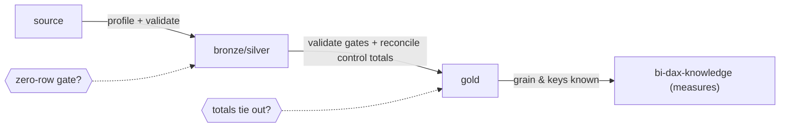

# SQL Validation & Reconciliation Playbook

> Validation gates, control-total reconciliation across layers, freshness/completeness, idempotency (SC-027..032). The Seshat BI signature layer; mostly original reasoning. See `../references/source-map.md`.

## Slice 5 overview -- why this matters for Seshat BI

This is the **trust layer**. Everything earlier (grain, joins, windows, dates) exists so that this
slice can answer one question with evidence: *"is this table correct enough to publish to the next
layer?"* Validation queries assert properties (uniqueness, not-null, referential integrity);
reconciliation queries prove that a **control total is invariant** across source -> silver -> gold.
For Seshat BI these are the **gates** that sit between pipeline stages and before any DAX measure
or dashboard consumes the data. A measure built on an unvalidated gold table is a confident wrong
number waiting to happen.

**The mental model:** a *validation gate* is a query whose **pass condition is precise and
repeatable** -- typically "**returns zero rows**" (no violations) or "**two totals are equal**"
(reconciled). If the gate fails, the promotion stops.



---

## Concept cards (continuing SC-001...026)

### SC-027 -- The validation gate
- **Definition.** A query whose result has a **binary pass condition** -- usually "zero rows means
  pass" (it finds violations) or "totals equal means pass". It runs before promoting data to the
  next layer.
- **Why it matters.** Repeatable, automatable trust. "I eyeballed it" is not a gate; a zero-row
  query is.
- **Common failure mode.** Manual spot-checks instead of a deterministic gate; gates that warn but
  never block.
- **Diagnostic question.** *"What is the exact pass condition, and does failing it stop promotion?"*
- **Retail example.** A uniqueness gate on `sales.order_line_id` that must return **0 rows**.
- **Feeds.** VP-* patterns - SQL-AP-028 - SARC-VAL-GATE-01.

### SC-028 -- Uniqueness & not-null checks
- **Definition.** Assert that a key is unique (no duplicates) and required fields are non-null. The
  most basic, highest-value gates (extends SC-004, SC-006, SC-008).
- **Why it matters.** A duplicated key fans out downstream joins (SC-011); a null in a required key
  drops rows from inner joins (SC-014). Catch both at the gate.
- **Common failure mode.** Assuming the source enforces a PK; not checking nullability of join keys.
- **Diagnostic question.** *"Which columns must be unique / not-null here, and is there a gate for
  each?"*
- **Retail example.** Uniqueness: `GROUP BY order_line_id HAVING COUNT(*)>1` -> 0 rows. Not-null:
  `WHERE product_key IS NULL` -> 0 rows.
- **Feeds.** VP-UNIQUE, VP-NOTNULL - SARC-VAL-GATE-01.

### SC-029 -- Referential integrity checks
- **Definition.** Every fact key has a matching dimension row (no orphans). Implemented as an
  anti-join (SC-012): fact LEFT JOIN dim WHERE dim key IS NULL.
- **Why it matters.** Orphan facts silently disappear from inner-join reports and break totals;
  they also signal a broken or late-arriving dimension load.
- **Common failure mode.** Trusting that all `product_key`s in `sales` exist in `product`; using
  `NOT IN` with nulls (SC-014) and getting a false "all good."
- **Diagnostic question.** *"Do all foreign keys resolve to a dimension row? How many orphans?"*
- **Retail example.** `sales s LEFT JOIN product p ON p.product_key=s.product_key WHERE
  p.product_key IS NULL` -> 0 rows.
- **Feeds.** VP-REFINTEGRITY - SARC-VAL-GATE-01.

### SC-030 -- Control totals & reconciliation
- **Definition.** A **control total** is a number that must be invariant across layers -- total
  revenue, count of distinct orders, sum of quantity. Reconciliation compares it source vs silver
  vs gold and flags any divergence.
- **Why it matters.** It's the single most powerful proof that a transformation didn't lose, drop,
  or inflate data. Row counts alone are not enough -- a fan-out can keep counts plausible while sums
  drift.
- **Common failure mode.** Reconciling only row counts; comparing layers at different grains (SC-005)
  so the totals were never meant to match.
- **Diagnostic question.** *"What total must be identical across layers, at what shared grain, and
  does it match?"*
- **Retail example.** `SUM(quantity*net_price)` over source `sales` must equal the same over gold
  `fact_sales`; report the difference, expect 0.
- **Feeds.** VP-CONTROLTOTAL, VP-ROWCOUNT - SQL-AP-029, SQL-AP-030 - SARC-RECON-TOTAL-01, SARC-RECON-GRAIN-01.

### SC-031 -- Freshness & completeness checks
- **Definition.** **Freshness**: the latest data is recent enough (`MAX(order_date)` within SLA).
  **Completeness**: every expected period is present (no missing days/months -- verified against the
  date spine, SC-023) and volumes are within expected bounds.
- **Why it matters.** A pipeline can pass uniqueness and reconcile *yesterday's* data perfectly
  while silently being a day stale or missing a store's feed. Freshness/completeness catch the
  "absence of data" failure (the Ch 6 anomaly class).
- **Common failure mode.** Checking only that rows exist, not that the *right periods/volumes* exist;
  completeness checked off the fact (missing periods invisible).
- **Diagnostic question.** *"Is the data current to SLA, and is every expected period/segment
  present at expected volume?"*
- **Retail example.** Completeness: date spine LEFT JOIN sales, `WHERE order_date IS NULL` within
  the loaded window -> 0 missing days.
- **Feeds.** VP-FRESHNESS, VP-COMPLETENESS - SQL-AP-032 - SARC-VAL-FRESH-01.

### SC-032 -- Idempotency & dedup verification
- **Definition.** **Idempotency**: re-running a transform produces the same result (same row count,
  same control totals) -- no accidental duplication on reload. **Dedup verification**: after a dedup
  step, row count equals distinct-key count (SC-013).
- **Why it matters.** Reloads and backfills are routine; a non-idempotent transform doubles data
  silently. The dedup gate proves the survivor logic actually produced one row per key.
- **Common failure mode.** Appending instead of replacing on reload; trusting a dedup without
  verifying one-row-per-key.
- **Diagnostic question.** *"If I re-run this, do row count and control totals stay identical? Is it
  exactly one row per key after dedup?"*
- **Retail example.** Post-dedup gate: `COUNT(*) = COUNT(DISTINCT order_line_id)` on the gold table.
- **Feeds.** VP-DEDUP - SQL-AP-031 - (links SARC-DEDUP-01 from Slice 2).

---

## Original retail examples (every gate's pass condition is explicit)

**1. Uniqueness gate (expect 0 rows).**
```sql
SELECT order_line_id, COUNT(*) AS n
FROM gold.fact_sales
GROUP BY order_line_id
HAVING COUNT(*) > 1;            -- PASS = no rows
```

**2. Not-null gate on required keys (expect 0 rows).**
```sql
SELECT COUNT(*) AS null_product_keys
FROM gold.fact_sales
WHERE product_key IS NULL;     -- PASS = 0
```

**3. Referential-integrity gate (orphan facts, expect 0 rows).**
```sql
SELECT s.order_line_id
FROM gold.fact_sales s
LEFT JOIN gold.dim_product p ON p.product_key = s.product_key
WHERE p.product_key IS NULL;   -- PASS = no orphans
```

**4. Control-total reconciliation (source vs gold, expect difference = 0).**
```sql
WITH src AS (SELECT SUM(quantity * net_price) AS revenue FROM source.sales),
     gld AS (SELECT SUM(quantity * net_price) AS revenue FROM gold.fact_sales)
SELECT src.revenue AS source_revenue,
       gld.revenue AS gold_revenue,
       src.revenue - gld.revenue AS difference   -- PASS = 0 (within tolerance)
FROM src CROSS JOIN gld;
```

**5. Row-count + distinct-order reconciliation (both must tie out).**
```sql
SELECT
  (SELECT COUNT(*)                 FROM source.sales) AS src_rows,
  (SELECT COUNT(*)                 FROM gold.fact_sales) AS gold_rows,
  (SELECT COUNT(DISTINCT order_id) FROM source.sales) AS src_orders,
  (SELECT COUNT(DISTINCT order_id) FROM gold.fact_sales) AS gold_orders;
-- PASS = src_rows = gold_rows AND src_orders = gold_orders
```

**6. Freshness gate (expect recent max date).**
```sql
SELECT MAX(order_date) AS latest_date,
       CURRENT_DATE - MAX(order_date) AS days_stale   -- PASS = days_stale <= SLA
FROM gold.fact_sales;
```

**7. Completeness via the date spine (missing days, expect 0 rows).**
```sql
SELECT d.date
FROM date d
LEFT JOIN gold.fact_sales s ON s.order_date = d.date
WHERE d.date >= DATE '2025-01-01' AND d.date < DATE '2025-02-01'
GROUP BY d.date
HAVING COUNT(s.order_line_id) = 0;   -- PASS = no missing days in the loaded window
```

**8. Dedup / idempotency gate (expect equal counts).**
```sql
SELECT COUNT(*) AS rows, COUNT(DISTINCT order_line_id) AS keys
FROM gold.fact_sales;                -- PASS = rows = keys (one row per key)
```

---

## Reconciliation method (the agent's routine)

1. **Pick control totals** that must be invariant for this table (revenue, quantity, distinct
   orders) -- at a **shared grain** both layers actually have (SC-005, SC-030).
2. **Compare layer by layer** (source -> silver -> gold); locate the *first* layer where a total
   diverges -- that's where the bug is.
3. **Pair counts with value totals** -- counts alone miss fan-out; values alone miss dropped rows.
4. **Gate the promotion** on the zero-row / equal-total conditions; failing blocks publish.
5. **Add freshness + completeness** so "correct but stale/partial" is also caught.

## Slice 5 symptom playbook

- **"Gold revenue != source revenue"** -> control-total break (SC-030). Reconcile layer by layer; find
  the first divergence; suspect fan-out (Slice 2) or a dropped/filtered row.
- **"Counts match but the sum is off"** -> fan-out kept counts plausible while values inflated/lost
  (SC-030, SC-011). Add a value control total, not just row counts.
- **"Reconciliation says mismatch but data looks fine"** -> comparing different grains (SC-030,
  SC-005). Align to a shared grain before comparing.
- **"Everything passes but numbers are stale/missing a store"** -> no freshness/completeness gate
  (SC-031). Add recency and spine-based completeness checks.
- **"Reload doubled the data"** -> non-idempotent transform (SC-032). Verify row=key counts; switch
  append->replace/merge.
- **Stop & request metadata when** the authoritative source total, the SLA, or the expected
  period/volume isn't known -- these are inputs to the gate, not guesses.

## Routing note (Seshat BI)

This slice produces the gates that make a gold table **trustworthy**; once it passes, the validated
grain and keys hand off to `bi-dax-knowledge` (which relies on a known grain for additivity). Source
readiness/mapping that precedes profiling belongs to `retail-bi`.

## Feeds

- Concepts: SC-027...SC-032 (extend SC-004, SC-005, SC-011, SC-012, SC-014, SC-023).
- Validation patterns: `patterns/sql-validation-patterns.json` (VP-UNIQUE, VP-NOTNULL,
  VP-REFINTEGRITY, VP-ROWCOUNT, VP-CONTROLTOTAL, VP-FRESHNESS, VP-COMPLETENESS, VP-DEDUP, VP-RANGE).
- Anti-patterns: SQL-AP-028...SQL-AP-032.
- Analyzer candidates: SARC-VAL-GATE-01, SARC-RECON-TOTAL-01, SARC-RECON-GRAIN-01,
  SARC-VAL-COUNTONLY-01, SARC-VAL-FRESH-01.
