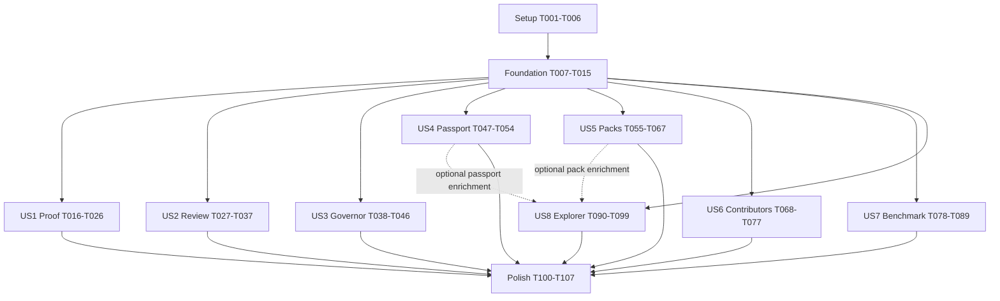

# Implementation Dependency Graph and Safe Parallelism

This graph refines `tasks.md` into executable dependency batches. A dependency means the
predecessor must be complete and its tests green before the successor is merged.

## Safety Rules

1. Complete Setup and Foundation before any user-story implementation.
2. Test-authoring tasks may start in parallel with sibling test-authoring tasks. Tests are
   expected to fail until their implementation predecessor lands.
3. Never concurrently edit a serialized hotspot listed below in one shared worktree.
4. Story modules with disjoint paths may be developed concurrently after Foundation.
5. Merge each story through its checkpoint before publishing a capability claim.
6. US8 may start after Foundation, but passport enrichment waits for US4 and pack
   enrichment waits for US5.
7. Final verification runs only after every story included in the target release is
   integrated.

## Global DAG



Release order remains US1 through US8 even when implementation lanes overlap.

## Serialized Hotspots

Tasks in the same row must be merged sequentially. Parallel branches may prepare changes,
but only one task at a time may modify the shared file.

| Lane | File | Serialized task order |
|------|------|-----------------------|
| CLI parser | `src/seshat/cli/parser.py` | T021 -> T032 -> T044 -> T052 -> T062 -> T085 -> T097 |
| CLI dispatcher | `src/seshat/cli/__init__.py` | T033 -> T045 -> T053 -> T063 -> T086 -> T098 |
| Public README | `README.md` | T025 -> T104 |
| Package metadata | `pyproject.toml` | T001 before T043/T044 and browser integration tests |
| Published schemas | `schemas/*.json` | T002-T005 use disjoint files; T015 validates all after they land |
| Shared projection | `src/seshat/readiness_projection.py` | T012 before T019/T031/T041/T050/T093 |
| Shared identity | `src/seshat/artifact_identity.py` | T011 before T050/T059 and review fingerprints |
| Shared disclosure | `src/seshat/disclosure.py` | T013 before public-output tasks T019/T030/T042/T050/T060/T083/T094 |
| Shared CLI guards | `src/seshat/cli/guards.py` | T014 before output-writing parser/handler tasks |
| Release record | `CHANGELOG.md` | T105 only, after included story checkpoints |

## Wave Plan

Up to four implementation lanes may run concurrently. A wave completes only after its
merge gate passes.

### Wave 0 - Setup

Safe concurrent batch:

- Lane A: T001
- Lane B: T002, then T003
- Lane C: T004, then T005
- Lane D: T006

Merge gate: package metadata parses, four schemas parse, output roots are ignored, and
tracked reference fixtures remain visible.

### Wave 1 - Foundation Tests

Safe concurrent batch:

- Lane A: T007
- Lane B: T008
- Lane C: T009
- Lane D: T015 test skeleton, completed only after T010 and T002-T005

These tasks have disjoint test files.

### Wave 2 - Foundation Implementation

```text
T007 -> T010
T007 -> T011
T008 + T010 + T011 -> T012
T009 + T010 + T011 -> T013
T010 + T011 + T013 -> T014
T002-T005 + T010 -> T015 completion
```

Safe concurrent batch 2A: T010 and T011. After both merge, T012 and T013 may run in
parallel. T014 and final T015 follow.

Foundation merge gate: T007-T015 green plus `retail check` green.

### Wave 3 - Story Contract Tests

After Foundation, test-authoring work is safe across disjoint story files:

- Lane A: T016-T018 (US1)
- Lane B: T027-T029 (US2)
- Lane C: T038-T040 (US3)
- Lane D: T047-T049 (US4)

US5-US8 test tasks may begin as lanes free up: T055-T057, T068, T078-T080, T090-T092.

### Wave 4 - First Release and Independent Cores

Recommended four-lane allocation:

- Lane A, release-critical: US1 T019-T026
- Lane B: US2 core T030-T031
- Lane C: US3 core T041-T043
- Lane D: US4 core T050-T051

Do not merge shared CLI tasks concurrently. Use the CLI integration queue below.

### Wave 5 - Content and Additional Cores

Recommended four-lane allocation:

- Lane A: US5 T058-T061
- Lane B: US6 T069-T076
- Lane C: US7 T081-T084 plus T087-T088
- Lane D: US8 T093-T096

US5 reference packs T064-T066 are mutually parallel after T060 defines validation.
US6 issue forms T069-T073 are mutually parallel after T068 fixes their contract.
US7 scenario files T087-T088 are mutually parallel after T078 fixes their contract.
US8 assets T095-T096 are mutually parallel after the projection contract is stable.

### Wave 6 - Serialized CLI Integration Queue

Merge in release priority order:

1. US1: T021 -> T022
2. US2: T032 -> T033
3. US3: T044 -> T045
4. US4: T052 -> T053
5. US5: T062 -> T063
6. US7: T085 -> T086
7. US8: T097 -> T098

Each pair must rebase on the previous pair and run parser/help/dispatch regression tests.
US6 has no CLI integration and can merge independently.

### Wave 7 - Story Documentation and Checkpoints

Documentation paths are mostly disjoint and safe in parallel:

- T025-T026, T036-T037, T046, T054
- T067, T076-T077, T089, T099

T025 must precede T104 because both edit `README.md`. T076 must precede T077 because the
full contributor guide links to the newcomer path.

### Wave 8 - Cross-Cutting Verification

```text
All included story checkpoints -> T100, T101, T102, T103
T100-T103 -> T104, T105
T104-T105 -> T106
T106 -> T107
```

T100-T103 use disjoint files and are safe in parallel. T104 and T105 are safe in parallel
with each other. T107 is the terminal gate.

## Per-Story DAGs

### US1 - Truthful First Success

```text
T016 + Foundation -> T019 -> T020
T016 + T014 -> T021
T019 + T020 + T021 -> T022
T016 -> T023 and T024
T022 + T023 + T024 -> T017
T022 -> T018
T017 + T018 -> T025
T022 -> T026
T025 + T026 -> US1 checkpoint
```

### US2 - Change Review

```text
T027 -> T030
T028 + T012 -> T031
T030 -> T032
T031 + T032 -> T033
T029 + T033 -> T034 -> T035
T034 + T035 -> T036
T034 -> T037
T029 + T036 + T037 -> US2 checkpoint
```

### US3 - Agent Governor

```text
T038 + T012 -> T041 -> T042
T039 + T041 + T042 -> T043
T043 -> T044 -> T045
T040 + T045 -> T046 -> US3 checkpoint
```

### US4 - Readiness Passport

```text
T047 + T011 + T012 -> T050
T048 + T050 -> T051
T049 + T050 + T051 -> T052 -> T053
T053 -> T054 -> US4 checkpoint
```

### US5 - Governed Packs

```text
T055 -> T058 -> T059
T055 + T056 + T059 + T013 -> T060
T057 + T060 -> T061
T060 -> T064, T065, T066
T061 -> T062 -> T063
T063 + T064 + T065 + T066 -> T067 -> US5 checkpoint
```

### US6 - Contributor Experience

```text
T068 -> T069, T070, T071, T072, T073, T074, T075
T069-T075 -> T076 -> T077 -> US6 checkpoint
```

### US7 - Safety Benchmark

```text
T078 -> T081
T078 -> T087 and T088
T079 + T081 -> T082 -> T083 -> T084
T080 + T084 -> T085 -> T086
T086 + T087 + T088 -> T089 -> US7 checkpoint
```

### US8 - Static Explorer

```text
T090 + T012 -> T093 -> T094
T090 -> T095 and T096
T094 + T095 + T096 -> T091
T092 + T094 -> T097 -> T098
T091 + T098 -> T099 -> US8 checkpoint
```

Optional enrichment edges: `US4 checkpoint -> T093` for passport views and `US5
checkpoint -> T093` for pack metadata. The base explorer must pass without either edge.

## Safe Ownership Matrix

| Concurrent lane | Owned paths | Must not edit |
|-----------------|-------------|---------------|
| Foundation | `src/seshat/{ecosystem_contracts,artifact_identity,readiness_projection,disclosure}.py`, foundation tests | Story modules, CLI parser/dispatcher |
| US1 | `src/seshat/demo/`, demo tests/docs/assets | Shared projection internals after Foundation |
| US2 | `src/seshat/{sarif,review_integration}.py`, `integrations/github-action/` | MCP, passport, packs, benchmark, explorer |
| US3 | `src/seshat/governor/`, governor tests/docs | Review integration and generated output modules |
| US4 | `src/seshat/passport.py`, passport tests/docs | Pack and benchmark models |
| US5 | `src/seshat/packs/`, `packs/reference/`, pack tests/docs | Core stage definitions or approvals |
| US6 | `.github/ISSUE_TEMPLATE/`, contributor docs/tests | CLI and runtime modules |
| US7 | `src/seshat/benchmark/`, `benchmark/scenarios/`, benchmark tests/docs | Readiness authority and live validators |
| US8 | `src/seshat/explorer/`, explorer tests/docs | Shared projection contract without coordination |
| CLI integrator | `src/seshat/cli/parser.py`, `src/seshat/cli/__init__.py` | Story core implementation |

## Merge Gate Per Story

Before merging a story lane:

1. Rebase onto the latest CLI integration queue head.
2. Run the story's unit, contract, and integration tests.
3. Run CLI help/parser regression tests when the story adds commands.
4. Run `ruff format --check src tests` and `ruff check src tests`.
5. Run `retail check` and confirm no readiness claim exceeds available evidence.
6. Verify `git diff --check` and inspect the diff for cross-lane files.
7. Update capability prose only after the story checkpoint passes.

## Recommended Maximum Concurrency

- Setup/Foundation: 2-4 lanes as defined above.
- Story test authoring: up to 4 lanes.
- Story core implementation: up to 4 lanes with disjoint ownership.
- CLI integration: exactly 1 lane.
- README/release metadata: exactly 1 lane per file.
- Final verification: 1 terminal lane after parallel prechecks complete.
