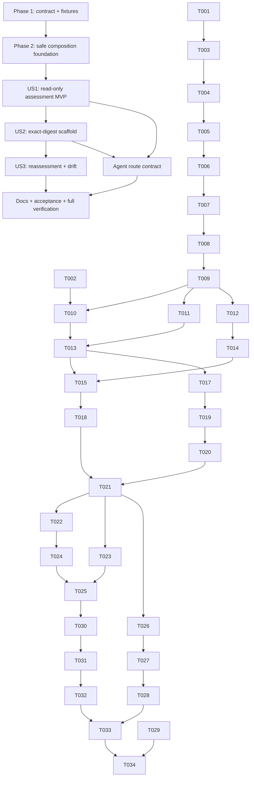

# Tasks: Governed Existing PBIP Adoption

**Input**: Design documents in `specs/126-adopt-existing-pbip/`

**Prerequisites**: `spec.md`, `plan.md`, `research.md`, `data-model.md`,
`contracts/`, and `quickstart.md`

**Interaction model**: Check each `- [ ]` item only after its named verification
passes. Stop at every checkpoint; do not advance a readiness stage or grant an
approval while implementing this feature.

## Task format

- `[P]` means the task can be authored concurrently because it has a disjoint
  write scope and no unfinished dependency.
- `[US1]`, `[US2]`, and `[US3]` map work to the independently testable user
  stories in `spec.md`.
- Every task names its implementation or verification path.

## Phase 1: Contract and fixture setup

**Purpose**: Establish the public output shape and safe reference projects before
domain implementation.

- [ ] T001 Promote both JSON design contracts from `specs/126-adopt-existing-pbip/contracts/` byte-for-byte to `schemas/pbip-adoption-assessment.schema.json` and `schemas/pbip-adoption-scaffold-result.schema.json`
- [ ] T002 [P] Build the generic supported, unsafe-literal, missing-model, multi-model, unsupported-schema, symlink-escape, and PBIX-boundary fixture matrix under `tests/fixtures/pbip_adoption/` without real secrets or business-specific C086 assumptions
- [ ] T003 Add valid-minimum, classification, relative-path, exactly-one-next-step, empty-approval, no-score, and seeded-invalid contract cases in `tests/contract/test_pbip_adoption_schema.py`

**Checkpoint**: The schema is valid JSON, the valid reference document passes,
and each seeded invalid document fails for the intended reason.

---

## Phase 2: Foundational composition layer

**Purpose**: Build the authority-safe primitives shared by all three stories.
This phase blocks every user-story implementation.

- [ ] T004 Define the normalized assessment entities, five classifications, stable ordering, canonical SHA-256 assessment digest, and shared text renderer in `src/seshat/pbip_adoption.py`
- [ ] T005 Add project-root resolution, relative locator normalization, symlink/traversal containment, readable-file handling, and deterministic file fingerprinting in `src/seshat/pbip_adoption.py`
- [ ] T006 Compose the shipped TMDL/PBIR readers to inventory PBIP projects, semantic models, reports, tables, measures, relationships, parameters, pages, visuals, unsupported boundaries, and ambiguity in `src/seshat/pbip_adoption.py`
- [ ] T007 Compose Git worktree/tracked/dirty evidence status and the existing rule registry/runner without treating non-versioned or dirty files as committed evidence in `src/seshat/pbip_adoption.py`
- [ ] T008 Add collection-time redaction plus fail-closed final `scan_disclosure` validation so normalized output contains no absolute roots, credentials, connection literals, raw values, or suspected PII in `src/seshat/pbip_adoption.py`
- [ ] T009 Compose `build_status_projection`, `build_blocker_explanations`, `build_run_next_response`, and existing stage order into one deterministic project-level `next_step`, returning one ambiguity-resolution action instead of silently selecting a table in `src/seshat/pbip_adoption.py`

**Checkpoint**: Foundational helpers are offline, deterministic, read-only, and
own no readiness/approval decision.

---

## Phase 3: User Story 1 - Assess an Existing PBIP Project (Priority: P1)

**Goal**: Return a cited, redacted assessment and exactly one governed next step
without changing the selected project.

**Independent Test**: Hash every file in the supported fixture, run text and JSON
assessment, verify inventory/classification/evidence/next-step parity, and confirm
all hashes and directory entries are unchanged.

### Tests for User Story 1

- [ ] T010 [P] [US1] Add supported-project inventory, cited-observation, proposed-meaning, missing-governance, deterministic-repeat, and byte-identity tests in `tests/unit/test_pbip_adoption.py`
- [ ] T011 [P] [US1] Add secret-redaction, non-gold/unsafe governance finding, non-Git, PBIX, missing external model, multi-model ambiguity, unsupported schema, unreadable input, and out-of-root refusal tests in `tests/unit/test_pbip_adoption_safety.py`
- [ ] T012 [P] [US1] Add parser, text/JSON parity, exit-code, concise-error, and traceback-free assessment tests in `tests/unit/test_cli_pbip_adoption.py`

### Implementation for User Story 1

- [ ] T013 [US1] Implement the public read-only `assess_pbip()` orchestration and schema-valid normalized result in `src/seshat/pbip_adoption.py` to satisfy T010-T011
- [ ] T014 [US1] Define the argparse-only `adopt-pbip assess --project --format` surface in `src/seshat/cli/parser_adoption.py` and assemble it from `src/seshat/cli/parser.py`
- [ ] T015 [US1] Implement assessment text/JSON output and exit policy in `src/seshat/cli/commands/adopt_pbip.py`, then add the lazy `adopt-pbip` dispatch row in `src/seshat/cli/__init__.py` to satisfy T012
- [ ] T016 [US1] Document the assessment boundary, classifications, PBIX guidance, outputs, and one-next-action behavior in `docs/tools/pbip-adoption.md`

**Checkpoint**: User Story 1 works independently as the MVP; assessment creates
no file and cannot produce a readiness pass or approval.

---

## Phase 4: User Story 2 - Create the Governed Adoption Scaffold (Priority: P2)

**Goal**: After exact digest acceptance, create only the declared Seshat-owned
baseline manifest while preserving every existing byte.

**Independent Test**: Assess a Git fixture copy, accept the current digest, and
verify that only `.seshat/adoption/pbip-adoption.yaml` appears; repeat with no
acceptance, a stale digest, dirty input, collision, linked parent, and simulated
publication failure and verify `written: []` plus zero partial files.

### Tests for User Story 2

- [ ] T017 [P] [US2] Add explicit acceptance, stale digest, Git prerequisite, dirty input, fixed write plan, empty approvals, collision, linked escape, simulated interruption, no-partial-result, and pre/post existing-file hash tests in `tests/unit/test_pbip_adoption_scaffold.py`
- [ ] T018 [P] [US2] Add scaffold-result schema, CLI parser, required digest, text/JSON result parity, exit-code, and traceback-free refusal cases in `tests/contract/test_pbip_adoption_schema.py` and `tests/unit/test_cli_pbip_adoption.py`

### Implementation for User Story 2

- [ ] T019 [US2] Render the accepted baseline with safe fingerprints, facts, proposals, concrete blockers, canonical next step, and `approvals: []` in `src/seshat/pbip_adoption.py`
- [ ] T020 [US2] Implement full preflight, same-filesystem staging, absent-target publication, handled-failure cleanup, and collision-safe creation of `.seshat/adoption/pbip-adoption.yaml` in `src/seshat/pbip_adoption.py` to satisfy T017
- [ ] T021 [US2] Add `adopt-pbip scaffold --project --accept-assessment --format` to `src/seshat/cli/parser_adoption.py` and wire its result/exit policy through `src/seshat/cli/commands/adopt_pbip.py` to satisfy T018

**Checkpoint**: User Stories 1 and 2 pass independently; the write path creates
one new evidence seam only after exact acceptance and never overwrites.

---

## Phase 5: User Story 3 - Reassess Adoption Progress (Priority: P3)

**Goal**: Compare current authoritative inputs with the accepted baseline, surface
drift, and recompute the existing one-next-action answer without adoption state.

**Independent Test**: Assess and scaffold a fixture, reassess unchanged, then add,
remove, and change governed inputs. Verify stable unchanged output, explicit
change facts, the earliest canonical next step, and no independent stage status.

### Tests for User Story 3

- [ ] T022 [P] [US3] Add unchanged, added, removed, changed, deterministic-order, and changed-PBIP evidence cases in `tests/unit/test_pbip_adoption_reassessment.py`
- [ ] T023 [P] [US3] Add dirty readiness evidence and stale human-approval cases proving reassessment delegates validity to existing predicates in `tests/unit/test_pbip_adoption_reassessment.py`

### Implementation for User Story 3

- [ ] T024 [US3] Add fail-closed loading of the adoption manifest as a fingerprint baseline and compute added/removed/changed/unchanged `AdoptionChange` rows in `src/seshat/pbip_adoption.py`
- [ ] T025 [US3] Integrate change facts into `assess_pbip()` and recompute readiness/approval results exclusively through existing Seshat projections and predicates in `src/seshat/pbip_adoption.py` to satisfy T022-T023

**Checkpoint**: All three stories are independently verifiable; reassessment has
no clock, score, stage engine, or approval authority.

---

## Phase 6: Agent and marketplace discovery

**Purpose**: Make the shipped path discoverable to Power BI analysts using local
agents, the Claude marketplace bundle, or the Codex plugin without forking their
behavior.

- [ ] T026 Add red tests for the local PBIP skill route, public Seshat router route, truthful capability record, and deterministic Claude/Codex regeneration in `tests/unit/test_capability_inventory.py` and `tests/contract/test_generated_agent_bundles.py`
- [ ] T027 Update `.claude/skills/pbip-workflow/SKILL.md`, `distribution/bundle-templates/shared/skills/seshat-bi/SKILL.md`, and `docs/capabilities/capabilities.yaml` to route existing PBIP adoption through the installed `seshat adopt-pbip assess` command while preserving all readiness hard stops
- [ ] T028 Regenerate `integrations/claude-code/seshat-bi/` and `integrations/codex/seshat-bi/` only through `C:\Users\user\miniforge3\python.exe scripts/export_agent_bundles.py`, then satisfy T026 and the external bundle acceptance checks

**Checkpoint**: Claude and Codex expose the same reviewed route and generated
provenance; no generated bundle file was hand-edited.

---

## Phase 7: Documentation and cross-cutting verification

**Purpose**: Close traceability, distribution, performance, and regression
boundaries before review.

- [ ] T029 [P] Add the existing-project adoption journey and PBIX-to-PBIP handoff to `README.md` and `docs/user/bi-delivery.md`, linking `docs/tools/pbip-adoption.md`
- [ ] T030 [P] Extend the generic fixture acceptance matrix to cover all SC-001 through SC-010 in `tests/unit/test_pbip_adoption_acceptance.py`
- [ ] T031 Add the typical-scope no-truncation and under-five-minute reference assertion for five reports, five models, 500 measures, and 100 pages in `tests/unit/test_pbip_adoption_acceptance.py`
- [ ] T032 Run `C:\Users\user\miniforge3\python.exe -m pytest tests/contract/test_pbip_adoption_schema.py tests/unit/test_pbip_adoption*.py tests/unit/test_cli_pbip_adoption.py -q` and resolve every failure without weakening assertions
- [ ] T033 Run Ruff plus the full unit suite, generated-bundle checks, and `C:\Users\user\miniforge3\python.exe -m seshat.cli check`; record live/database/Power BI execution as deliberately not run in the PR evidence
- [ ] T034 Execute every path in `specs/126-adopt-existing-pbip/quickstart.md` against disposable fixture copies and verify assessment byte identity, exact-digest acceptance, collision refusal, and reassessment behavior

**Final checkpoint**: All requirements and success criteria have passing evidence;
static green is reported as necessary but not semantic/live correctness.

---

## Dependencies and execution order

### Phase dependencies

- Phase 1 has no dependency.
- Phase 2 depends on T001-T003 and blocks all user stories.
- US1 depends on T004-T009 and is the MVP.
- US2 depends on the US1 assessment/digest contract.
- US3 depends on US1 plus the US2 baseline manifest.
- Agent discovery depends on the stable US1/US2 command contract.
- Final verification depends on all selected stories and agent-discovery work.

### Within-story ordering

- Write each story's tests first and confirm they fail for the intended missing
  behavior before implementing that story.
- Keep schema/model work before orchestration, orchestration before CLI wiring,
  and implementation before full regression verification.
- Stop after any story checkpoint if its independent test is not green.

### Parallel opportunities

- T002 can proceed while T001/T003 establish the schema contract.
- T010-T012, T017-T018, and T022-T023 have disjoint test concerns within their
  story and can be authored in parallel.
- T029 and T030 are disjoint after implementation stabilizes.
- No task that edits `src/seshat/pbip_adoption.py` is marked parallel; this avoids
  conflicting writes to the shared composition module.

## Requirement coverage

| Requirement group | Primary tasks |
|---|---|
| FR-001-FR-006 inventory, coverage, classifications, citations | T002-T006, T010, T013 |
| FR-007-FR-010 authority, readiness reuse, one next step | T007, T009-T010, T013 |
| FR-011-FR-014 read-only, disclosure, existing findings, offline | T005, T007-T008, T011-T013 |
| FR-015-FR-020 acceptance and safe scaffold | T017-T021 |
| FR-021-FR-022 deterministic reassessment and drift | T022-T025 |
| FR-023-FR-026 PBIX, containment, no score, graceful boundaries | T003, T005, T008, T011 |
| FR-027-FR-030 parity, composition, no persisted assessment, Git rule | T007, T012-T015, T017-T021 |
| SC-001-SC-010 measurable acceptance | T030-T034 |

## Implementation strategy

1. Deliver US1 first as a read-only adoption assessment MVP.
2. Add US2 only after the digest and write-free contract is stable.
3. Add US3 using the accepted manifest only as a fingerprint baseline.
4. Expose the stable route through local and public agent surfaces.
5. Finish with the full reference matrix and governance/distribution gates.

## Dependency graph

